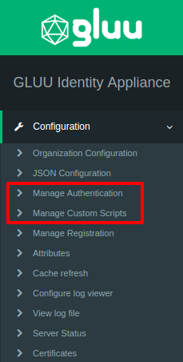

[TOC]
# Authentication in Gluu Server
Gluu Server supports a wide range of authentication mechanisms including multi-factor authentication. It will be an understatement to say that Gluu Server only performs authentication, it also provides authorization making Gluu CE a complete identity management suite. The identity management suite supports multiple protocols such as SAML, OpenID Connct, SCIM. The details will follow later in the administration guide.

Gluu Server CE makes it possible to define the business logic for complex authentication workflows providing Single-Sign On (SSO) using smart cards, tokens, mobile or even biometric authentication mechanisms. The choice of multi-factor authentication technology is not limited to one active at a time, rather it is possible to use multiple authentication technique active at the same time.

A number of multi-factor authentication scripts are shipped in the Gluu Server by default, including support for FIDO U2F tokens, Gluu's free mobile two-factor application [Super Gluu](https://super.gluu.org/), certificate authentication, and Duo Security.

Gluu Server leverages its interception script feature for multi-factor authentication--custom jython interception scripts can call third party authentication services via API's or vendor libraries. Sophisticated authentication logic can implement adaptive authentication. For example, you can add extra authentication steps based on contextual information, such as fraud scores, location, or browser profiling. You can also customize the look and feel of a web authentication: html, css, images and javascript can be externalized and managed by your organization.

**Authentication Management in Gluu CE**

