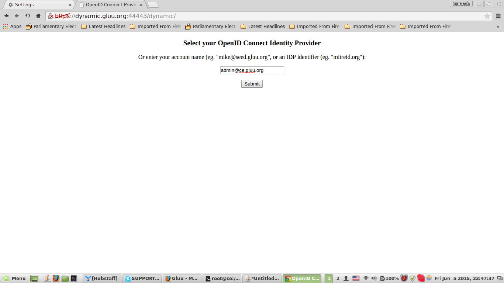
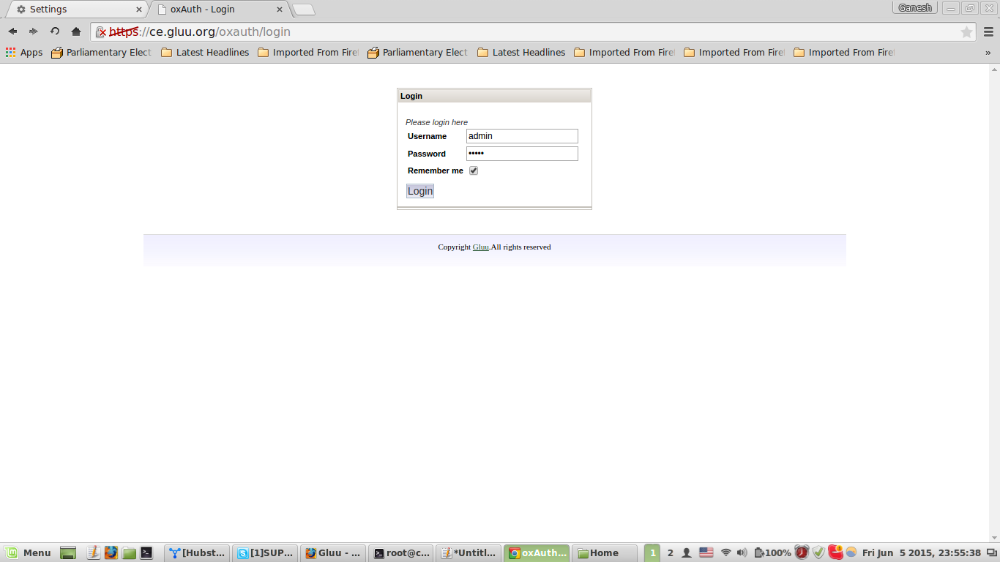

OpenID Connect in Gluu Server can be tested using the Apache module for the protocol. This section defines the installation for Apache Server with the OpenID Connect module and testing against Gluu Server. There are two different registration methods for the OpenID clients called Dynamic and Manual.

## 5.1 Ubuntu Server 14.04
This section defines the steps to install the OpenID Connect module for Apache, `auth_openidc` in Ubuntu. Please use the following commands to install Apache2, enable SSL and restart the server:


```
$ sudo apt-get install apache2
$ sudo a2enmod ssl
$ service apache2 restart
```

The next step is to create a self-signed certificate for SSL. The following commands will create a directory `/etc/apache2/ssl` and generate the certificates.


```
$ sudo mkdir /etc/apache2/ssl
$ sudo openssl req -x509 -nodes -days 365 -newkey rsa:2048 -keyout /etc/apache2/ssl/apache.key -out /etc/apache2/ssl/apache.crt
```


A prompt shall appear where the information related to the certificate needs filling. A template is given below:


```
	Country Name (2 letter code) [AU]:US
	State or Province Name (full name) [Some-State]:Texas
	Organization Name (eg, company) [Internet Widgits Pty Ltd]:Gluu Inc
	Organizational Unit Name (eg, section) []:Gluu Test
	Common Name (e.g. server FQDN or YOUR name) []:gluu.org
	Email Address []:support@gluu.org
```


The apache configuration to enable the SSL module comes next. The `default-ssl.conf` file should be updated with the newly generated certificate locations.

```
$ sudo vim /etc/apache2/sites-available/default-ssl.conf
```
Please update the location of the certificates with the following if you have used the commands given here. If you have used your own certificates or generated the certificates with a different name, please use that.

```
/etc/apache2/ssl/apache.key
/etc/apache2/ssl/apache.crt
```

!!! Note
    Activate the SSl Virtual Host, if you are running `auth_oidc` and `Gluu Server` in the same machine, and restart Apache Server

Please enable the SSL configuration and restart the Apache Server for the changes to take effect with the following commands:

```
$ sudo a2ensite default-ssl.conf
$ sudo service apache2 restart
```

The next step is to install and configure the Apache module for OpenID Connect. Run the following command to download and install the `auth_openidc` module:

```
$ sudo wget http://ftp.us.debian.org/debian/pool/main/liba/libapache2-mod-auth-openidc/libapache2-mod-auth-openidc_1.6.0-1_amd64.deb
$ sudo dpkg -i libapache2-mod-auth-openidc_1.6.0-1_amd64.deb
```

If the package is not available, please check this [Github Page](https://github.com/pingidentity/mod_auth_openidc/wiki)

!!! Warning
    This module depends on `libhiredis0.10, libpcre3, & libjansson4` package. If the dependencies are not met, please install them manually using the `apt-get` command

The default ports for `http` and `https` are not used for `auth_openidc` module, therefore it is necessary to update three files. The changes are done to avoid a conflict with the Gluu Server's Apache ports. 
But, if the Gluu Server and the Apache server are different, there is no need to change the ports.

Change port numbers to **44443** (for SSL) and **8000** (for non-SSL) in these three files.

* /etc/apache2/ports.conf
* /etc/apache2/sites-available/000-default.conf
* /etc/apache2/sites-available/default-ssl.conf

### 5.1.1 Dynamic Client Registration
The following example shows the configuration for dynamic client registration.
The OpenID Connect module requires a folder to store the metadata, therefore create a metadata folder and change permission using the following commands.


```
# mkdir /var/cache/apache2/metadata
# chown -R www-data:www-data /var/cache/apache2/metadata
```


Please add the following lines in the `auth_openidc.conf` configuration file under `/etc/apache2/mods-available/` folder.

```
OIDCMetadataDir /var/cache/apache2/metadata
OIDCClientSecret secret
OIDCRedirectURI https://dynamic.gluu.org:44443/dynamic/fake_redirect_uri
OIDCCryptoPassphrase secret
OIDCSSLValidateServer Off
```


The apache module can be enabled now and the following command will do the same. Please restart the Apache Server as well.

```
$ sudo a2enmod auth_openidc
$ sudo service apache2 restart
```


!!! Note
    Restart the server after configuring the module, else the server will not restart and it will throw errors. To check for errors, please chek the `errors.log` file in `/var/log/apache/` folder


The next step is to prepare the protected resource. In this example we shall create a simple `html` page and put it in a protected folder. The following commands will create a directory named `dynamic` and create a file `index.html:


```
$ sudo mkdir /var/www/html/dynamic
$ sudo vim /var/www/html/dynamic/index.html
```


Please add the following in the `index.html` file. If you have anything else prepared for this purpose, you can use that as well.


```
<html>
    <title>
        Protected URL
    </title>
    <body>
        Nice to see the protected url via Dynamic Registration
    </body>
</html>
```


The ownership of the entire html directory must be changed to Apache. Please use the following command to change the ownership:


```
$ sudo chown -R www-data:www-data /var/www/html
```

The apache configuration file must be added to the `/sites-available/` folder. The file is named `dynamic.conf` for convinience. Please use the following command to create the file and open it using `vim` editor:

```
$ cd /etc/apache2/sites-available/
$ vim dynamic.conf
```

Please add the follwoing in the `dynamic.conf` file:

```
<VirtualHost *:44443>
    ServerName dynamic.gluu.org
    DocumentRoot /var/www/html

    <Location /dynamic/>
        AuthType openid-connect
        Require valid-user
    </Location>

    SSLEngine On
    SSLCertificateFile /etc/apache2/ssl/apache.crt
    SSLCertificateKeyFile /etc/apache2/ssl/apache.key
</VirtualHost>
```

!!! Note
    We are using a custom port 44443 in this example, but it is possible to use the default SSL port 443, if the Apache server is stand-alone.

The dynamic site is added and configured in apache server. The following commands will enable the site and restart apache server so that the dynamic site is accessible:

```
$ sudo a2ensite dynamic.conf
$ sudo service apache2 restart
```

Please access the site @ `https://dynamic.gluu.org:44443/dynamic` and the discovery page will appear.



There are two ways the IDP is presented in the discovery page

1. admin@gluu-server-hostname.org
2. gluu-server-hostname.org

The administrator or the user can enter the data in any of the format shown above and click on submit. The user will be redirected to the Gluu Server CE oxAuth login page for credentials. If the authentication is successful, the client will be added in Gluu Server and the protected resource will be shown in the browser.


### 5.1.2 Manual Client Registration
	The procedure for manual client registration is different from the dynamic one. The configuration goes in the `auth_openidc` configuration file inside the apache folder. Please use the following command to open the file:

```
$ sudo vim /etc/apache2/mods-available/auth_openidc.conf
```

The following lines must be added in the file. Please remember to change the `OIDCProviderIssuer` to the hostname of the IDP you are using, as we are using `ce.gluu.org` in this example.

```
    OIDCRedirectURI https://static.gluu.org:44443/static/fake_redirect_uri
    OIDCCryptoPassphrase newsecret

    OIDCProviderMetadataURL https://ce.gluu.org/.well-known/openid-configuration
    OIDCClientID @!C648.9803.5565.E5CB!0001!0DB0.EEDB!0008!7728.5650
    OIDCClientSecret newsecret
    OIDCResponseType id_token
    OIDCProviderTokenEndpointAuth client_secret_basic

    OIDCProviderIssuer  https://ce.gluu.org
    OIDCSSLValidateServer Off
```

The next command will enable the Apache module.

```
$ sudo a2enmod auth_openidc
```

The next step is to prepare the protected resource. In this example we shall create a simple html page and put it in a protected folder. The following commands will create a directory named static and create a file `index.html`:

```
$ sudo mkdir /var/www/html/static
$ sudo vim /var/www/html/static/index.html
```

Please add the following in the `index.html` file. If you have anything else prepared for this purpose, you can use that as well.

```
<html>
    <title>
        Protected URL
    </title>
    <body>
        Nice to see the protected url via Static Registration
    </body>
</html>
```

The ownership of the entire html directory must be changed to Apache. Please use the following command to change the ownership:

```
$ sudo chown -R www-data:www-data /var/www/html
```

The apache configuration file must be added to the `/sites-available/` folder. The file is named `static.conf` for convinience. Please use the following command to create the file and open it using `vim` editor:

```
$ cd /etc/apache2/sites-available/
$ vim static.conf
```

Please add the following in the `static.conf` file:

```
<VirtualHost *:44443>
    ServerName static.gluu.org
    DocumentRoot /var/www/html

    <Location /static/>
        AuthType openid-connect
        Require valid-user
    </Location>

    SSLEngine On
    SSLCertificateFile /etc/ssl/certs/ssl-cert-snakeoil.pem
    SSLCertificateKeyFile /etc/ssl/private/ssl-cert-snakeoil.key
</VirtualHost>
```

The site must be enabled before it can be accessed from the outside. Please use the following command to enable the site and restart the Apache Server.

```
$ sudo a2ensite static.conf
$ sudo service apache2 restart
```

Please use the following address in your browser `https://static.gluu.org:44443/static` to access the oxAuth login page where the credentials for Gluu CE must be put to authenticate the user.



There is a possibility that the following error will be shown in the browser:

```
Error:

The OpenID Connect Provider returned an error: Error in handling response type.
```

The apache logs will contain the following if the error shown above is visible:

```
[Fri Jun 05 14:48:28 2015] [error] [client 124.253.60.123] oidc_proto_validate_idtoken: id_token JSON payload did not contain the required-by-spec "sub" string value, referer: https://static.gluu.org:44443/static/fake_redirect_uri
[Fri Jun 05 14:48:28 2015] [error] [client 124.253.60.123] oidc_proto_parse_idtoken: id_token payload could not be validated, aborting, referer: https://static.gluu.org:44443/static/fake_redirect_uri
```

This error is mitigated by the following procedure. 

```
$ sudo service gluu-server login
```

The ClientID is available from the oxTrust admin interface and the DN is searched from the Gluu Opendj with the following command:

```
/opt/opendj/bin/ldapsearch -T -X -Z -p 1636 -D "cn=Directory Manager" -j /root/.pw -s sub -b "o=gluu" 'inum=@!C648.9803.5565.E5CB!0001!0DB0.EEDB!0008!7728.5650'
```

Please create a file named `mod.ldif` with the contents given below. The `DN` used in `mod.ldif` is obtained from output of the command given above.

```
dn: inum=@!C648.9803.5565.E5CB!0001!0DB0.EEDB!0008!7728.5650,ou=clients,o=@!C648.9803.5565.E5CB!0001!0DB0.EEDB,o=gluu
changetype: modify
add: oxAuthSubjectIdentifier
oxAuthSubjectIdentifier: @!C648.9803.5565.E5CB!0001!0DB0.EEDB!0008!7728.5650
```

The `ldapmodify` command is used to insert the `oxAuthSubjectIdentifier`. An exampleof the command is given below:

```
$ sudo /opt/opendj/bin/ldapmodify -Z -X -h localhost -p 1636 -D "cn=Directory Manager" -j /root/.pw -f /root/mod.ldif
```

Now the manual client can be accessed from `https://static.gluu.org:44443/static` and the protected resource accessed. 
