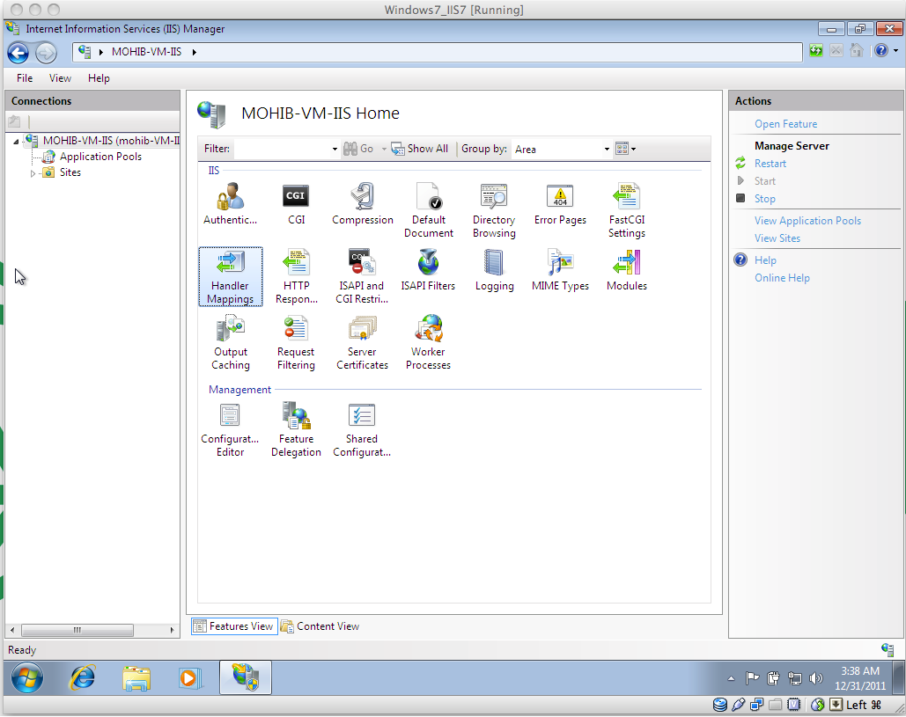
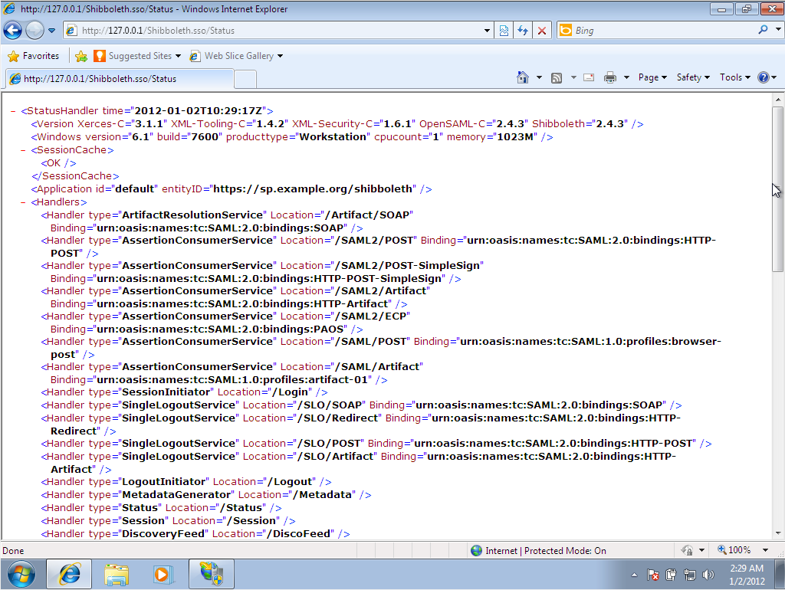
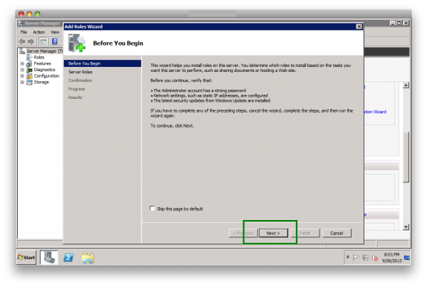

This section provides steps to test the SAML protocol for Gluu Server Community Edition (CE) with Shibboleth SP.

## 3.1 Ubuntu Server 14.04
The `mod-shib2` module is installed with Apache Server to enable Shibboleth SP in Ubuntu. The following command will install the necessary packages to install Apache Server with Shibboleth SP and enable the `https` protocol.

```
# apt-get install apache2 libshibsp6 libapache2-mod-shib2
# a2enmod cgi
# a2enmod ssl
# a2enmod shib2
# a2ensite default-ssl
```

The next step is to generate a self-signed certificate for the `https` protocol. If there is any available signed-certificate, that can be used too. This guide is for testing purpose only, so we used a self-signed certificate. The following commands will generate and sign the certificate.

```
# mkdir /etc/certs
# cd /etc/certs
# openssl genrsa -des3 -out minnow.key 2048
# openssl rsa -in minnow.key -out minnow.key.insecure
# mv minnow.key.insecure minnow.key
# openssl req -new -key minnow.key -out minnow.csr
# openssl x509 -req -days 365 -in minnow.csr -signkey minnow.key -out minnow.crt
```

It is necessary to generate a metadata for the Shibboleth SP which will be used to create the Trust Relationship in Gluu Server. The following commands will generate the metadata and start the Apache Server with Shibboleth daemon.

```
# shib-metagen -c /etc/certs/minnow.crt -h minnow.gluu.info > /etc/shibboleth/minnow-metadata.xml
# service apache2 start
# service shibd start
```

!!! Note
    Download the `minnow-metadata.xml` file to create the Trust Relationship in Gluu Server CE.

At this point, a folder protected by Shibboleth should be created and and added into the `default-ssl.conf` file. The following command will create a folder named `protected` and add the location in the SSL config file.

```
# mkdir /var/www/protected 
# vim /etc/apache2/sites-available/default-ssl.conf
```

Please add the following in the default-ssl.conf file
```
ScriptAlias /protected/ /var/www/protected/
<Directory /var/www/protected>
    AddHandler cgi-script .py
    Options +ExecCGI
    SSLOptions +StdEnvVars
    AuthType shibboleth
    ShibRequestSetting requireSession 1
    Require valid-user
</Directory>
```

A python script is created inside the protected directory to confirm that the SAML TR is working. The following commands will create the script.

```
# touch /var/www/protected/printHeaders.py
# chmod ugo+x /var/www/protected/printHeaders.py
# vim /var/www/protected/printHeaders.py
```
Please add the following the printHeaders.py file
```
#!/usr/bin/python

import os

d = os.environ
k = d.keys()
k.sort()

print "Content-type: text/html\n\n"

print "<HTML><HEAD><TITLE>Print Env Variables</TITLE></Head><BODY>"
print "<h1>Environment Variables</H1>"
for item in k:
    print "<p><B>%s</B>: %s </p>" % (item, d[item])
print "</BODY></HTML>"
```

The `shibboleth2.xml` file is quite large and confusing. It is recommended to use the following shortened configuration file and replace the same with the content below. The following command will open the Shibboleth configuration file in `vim`.

```
# vim /etc/shibboleth/shibboleth2.xml
```

!!! Note
    Please replace `minnow.gluu.info` with the hostname of the Shibboleth SP and `albacore.gluu.info` with the hostname of Gluu CE.

The IDP metadata is downloaded and named `albacore.xml` and placed in the `/etc/shibboleth/` folder.
```
<SPConfig xmlns="urn:mace:shibboleth:2.0:native:sp:config"
    xmlns:conf="urn:mace:shibboleth:2.0:native:sp:config"
    xmlns:saml="urn:oasis:names:tc:SAML:2.0:assertion"
    xmlns:samlp="urn:oasis:names:tc:SAML:2.0:protocol"    
    xmlns:md="urn:oasis:names:tc:SAML:2.0:metadata"
    logger="syslog.logger" clockSkew="180">
    <OutOfProcess logger="shibd.logger"></OutOfProcess>
    <UnixListener address="shibd.sock"/>
    <StorageService type="Memory" id="mem" cleanupInterval="900"/>
    <SessionCache type="StorageService" StorageService="mem" cacheAssertions="false"
                  cacheAllowance="900" inprocTimeout="900" cleanupInterval="900"/>
    <ReplayCache StorageService="mem"/>
    <RequestMapper type="Native">
        <RequestMap>
            <Host name="minnow.gluu.info">
                <Path name="protected" authType="shibboleth" requireSession="true"/>
            </Host>
        </RequestMap>
    </RequestMapper>
    <ApplicationDefaults entityID="https://minnow.gluu.info/shibboleth"
                         REMOTE_USER="uid"
                         metadataAttributePrefix="Meta-"
                         sessionHook="/Shibboleth.sso/AttrChecker"
                         signing="false" encryption="false">

        <Sessions lifetime="28800" timeout="3600" checkAddress="true"
            handlerURL="/Shibboleth.sso" handlerSSL="true" cookieProps="https" relayState="ss:mem">

            <SessionInitiator type="Chaining" Location="/Login" isDefault="true" id="Login"
                              entityID="https://albacore.gluu.info/idp/shibboleth">
                <SessionInitiator type="SAML2" template="bindingTemplate.html"/>
            </SessionInitiator>

            <md:AssertionConsumerService Location="/SAML2/POST-SimpleSign" index="2"
                Binding="urn:oasis:names:tc:SAML:2.0:bindings:HTTP-POST-SimpleSign"/>
            <md:AssertionConsumerService Location="/SAML2/POST" index="1"
                Binding="urn:oasis:names:tc:SAML:2.0:bindings:HTTP-POST"/>

            <LogoutInitiator type="Chaining" Location="/Logout">
                <LogoutInitiator type="SAML2" template="bindingTemplate.html"/>
                <LogoutInitiator type="Local"/>
            </LogoutInitiator>

            <md:SingleLogoutService Location="/SLO/Redirect" conf:template="bindingTemplate.html"
                Binding="urn:oasis:names:tc:SAML:2.0:bindings:HTTP-Redirect"/>
            <md:SingleLogoutService Location="/SLO/POST" conf:template="bindingTemplate.html"
                Binding="urn:oasis:names:tc:SAML:2.0:bindings:HTTP-POST"/>

            <Handler type="Status" Location="/Status"/>
            <Handler type="Session" Location="/Session" showAttributeValues="false"/>
            <Handler type="AttributeChecker" Location="/AttrChecker" template="attrChecker.html"
                attributes="uid" flushSession="true"/>
        </Sessions>

        <Errors supportContact="root@localhost"
            helpLocation="/about.html"
            styleSheet="/shibboleth-sp/main.css"/>

        <MetadataProvider type="XML" file="albacore.xml"/>
        <TrustEngine type="ExplicitKey"/>
        <TrustEngine type="PKIX"/>
        <AttributeExtractor type="XML" validate="true" reloadChanges="false" path="attribute-map.xml"/>
        <AttributeExtractor type="Metadata" errorURL="errorURL" DisplayName="displayName"/>
        <AttributeResolver type="Query" subjectMatch="true"/>
        <AttributeFilter type="XML" validate="true" path="attribute-policy.xml"/>
        <CredentialResolver type="File" key="/etc/certs/minnow.key" certificate="/etc/certs/squid.crt"/>
    </ApplicationDefaults>
    <SecurityPolicyProvider type="XML" validate="true" path="security-policy.xml"/>
    <ProtocolProvider type="XML" validate="true" reloadChanges="false" path="protocols.xml"/>

</SPConfig>
```

The `attribute-map.xml` file is shortened as well for this guide. The following command will open the file in `vim`.

```
# vim /etc/shibboleth/attribute-map.xml

<--Please replace the file with the contents below-->

<Attributes xmlns="urn:mace:shibboleth:2.0:attribute-map" xmlns:xsi="http://www.w3.org/2001/XMLSchema-instance">
    <Attribute name="urn:oid:2.5.4.42" id="givenName"/>
    <Attribute name="urn:oid:2.5.4.4" id="sn"/>
    <Attribute name="urn:oid:2.16.840.1.113730.3.1.241" id="displayName"/>
    <Attribute name="urn:oid:0.9.2342.19200300.100.1.1" id="uid"/>
</Attributes>
```

The final step is to test the configuration by creating a trust relationship. Please see section [2.1](./authentication-protocol-saml/#21-outbound-saml) for creating a Trust Relationship. The following attributes must be released: 

- Email
- Display Name
- First Name
- Last Name
- Username

!!! Note
    Please configure specific Relying Party and select the `SAML2SSO` profile with default options.

To test the setup, use this URL in your browser `https://minnow.gluu.info/protected/printHeaders.py`  and use valid credentials in Gluu Server which will produce something similar to the example given below.

```
**Environment Variables**

AUTH_TYPE: shibboleth
CONTEXT_DOCUMENT_ROOT: /var/www/protected/
CONTEXT_PREFIX: /protected/
DOCUMENT_ROOT: /var/www/html
GATEWAY_INTERFACE: CGI/1.1
HTTPS: on
HTTP_ACCEPT: text/html,application/xhtml+xml,application/xml;q=0.9,image/webp,*/*;q=0.8
HTTP_ACCEPT_ENCODING: gzip, deflate, sdch
HTTP_ACCEPT_LANGUAGE: en-US,en;q=0.8
HTTP_CONNECTION: keep-alive
HTTP_COOKIE: _shibsession_64656661756c7468747470733a2f2f6d696e6e6f772e676c75752e696e666f2f73686962626f6c657468=_6aab7e287072bcc123989d8bf5f0ed5e
HTTP_DNT: 1
HTTP_HOST: minnow.gluu.info
HTTP_UPGRADE_INSECURE_REQUESTS: 1
HTTP_USER_AGENT: Mozilla/5.0 (Windows NT 6.1; WOW64) AppleWebKit/537.36 (KHTML, like Gecko) Chrome/45.0.2454.85 Safari/537.36
PATH: /usr/local/sbin:/usr/local/bin:/usr/sbin:/usr/bin:/sbin:/bin
QUERY_STRING:
REMOTE_ADDR: 192.168.88.1
REMOTE_PORT: 52140
REMOTE_USER: mike
REQUEST_METHOD: GET
REQUEST_SCHEME: https
REQUEST_URI: /protected/printHeaders.py
SCRIPT_FILENAME: /var/www/protected/printHeaders.py
SCRIPT_NAME: /protected/printHeaders.py
SERVER_ADDR: 192.168.88.133
SERVER_ADMIN: webmaster@localhost
SERVER_NAME: minnow.gluu.info
SERVER_PORT: 443
SERVER_PROTOCOL: HTTP/1.1
SERVER_SIGNATURE:
Apache/2.4.7 (Ubuntu) Server at minnow.gluu.info Port 443
SERVER_SOFTWARE: Apache/2.4.7 (Ubuntu)
SHIB_Shib_Application_ID: default
SHIB_Shib_Authentication_Instant: 2015-09-17T01:13:23.278Z
SHIB_Shib_Authentication_Method: urn:oasis:names:tc:SAML:2.0:ac:classes:PasswordProtectedTransport
SHIB_Shib_AuthnContext_Class: urn:oasis:names:tc:SAML:2.0:ac:classes:PasswordProtectedTransport
SHIB_Shib_Identity_Provider: https://albacore.gluu.info/idp/shibboleth
SHIB_Shib_Session_ID: _6aab7e287072bcc123989d8bf5f0ed5e
SHIB_Shib_Session_Index: _40e4b17668a13e0d406e41cc9f6bf116
SHIB_displayName: Mike Schwartz
SHIB_givenName: Michael
SHIB_mail: mike@gmail.com
SHIB_sn: Schwartz
SHIB_uid: mike
SSL_CIPHER: ECDHE-RSA-AES128-GCM-SHA256
SSL_CIPHER_ALGKEYSIZE: 128
SSL_CIPHER_EXPORT: false
SSL_CIPHER_USEKEYSIZE: 128
SSL_CLIENT_VERIFY: NONE
SSL_COMPRESS_METHOD: NULL
SSL_PROTOCOL: TLSv1.2
SSL_SECURE_RENEG: true
SSL_SERVER_A_KEY: rsaEncryption
SSL_SERVER_A_SIG: sha256WithRSAEncryption
SSL_SERVER_I_DN: emailAddress=mike@gluu.org,CN=minnow.gluu.info,O=Gluu,L=Austin,ST=TX,C=US
SSL_SERVER_I_DN_C: US
SSL_SERVER_I_DN_CN: minnow.gluu.info
SSL_SERVER_I_DN_Email: mike@gmail.com
SSL_SERVER_I_DN_L: Austin
SSL_SERVER_I_DN_O: Gluu
SSL_SERVER_I_DN_ST: TX
SSL_SERVER_M_SERIAL: 9F5E4F891590BB53
SSL_SERVER_M_VERSION: 1
SSL_SERVER_S_DN: emailAddress=mike@gluu.org,CN=minnow.gluu.info,O=Gluu,L=Austin,ST=TX,C=US
SSL_SERVER_S_DN_C: US
SSL_SERVER_S_DN_CN: minnow.gluu.info
SSL_SERVER_S_DN_Email: mike@gmail.com
SSL_SERVER_S_DN_L: Austin
SSL_SERVER_S_DN_O: Gluu
SSL_SERVER_S_DN_ST: TX
SSL_SERVER_V_END: Sep 10 18:46:32 2016 GMT
SSL_SERVER_V_START: Sep 11 18:46:32 2015 GMT
SSL_SESSION_RESUMED: Initial
SSL_TLS_SNI: minnow.gluu.info
SSL_VERSION_INTERFACE: mod_ssl/2.4.7
SSL_VERSION_LIBRARY: OpenSSL/1.0.1f
```

## 3.2 CentOS 6.8
The Shibboleth SP is available for download from the Shibboleth repo in CentOS 6.x. The shibboleth repo is available in the follwoing link:

```
http://download.opensuse.org/repositories/security:/shibboleth/CentOS_CentOS-6/security:shibboleth.repo
```

Please use the following command to download the shibboleth repo and install shibboleth SP.

```
# wget http://download.opensuse.org/repositories/security:/shibboleth/CentOS_CentOS-6/security:shibboleth.repo -O /etc/yum.repos.d/shib.repo
# yum install shibboleth
# service shibd start
# chkconfig shibd on
```

The next step is to install Apache server in the machine.

```
# yum install httpd
# service httpd start
# service iptables stop
```

The following changes should be made in `httpd.conf` file. Use the following command to open the file:

```
# vi /etc/httpd/conf/httpd.conf
```

- Change the `ServerName` directive to the server name of the SP
- Set `UseCanonicalName` On
- Restart the httpd service using the command `service httpd restart`
- Create an index.html file inside the directory `/var/www/html`
- Restart the httpd service using the command `service httpd restart`
- Check from your browser if the file `index.html` is visible.

The next step is to generate a self-signed certificate for the https protocol. If there is any available signed-certificate, that can be used too. This guide is for testing purpose only, so we used a self-signed certificate. The following commands will generate and sign the certificate.

```
# cd /etc/shibboleth
# openssl genrsa -des3 -out minnow.key 2048
# openssl rsa -in minnow.key -out minnow.key.insecure
# mv minnow.key.insecure minnow.key
# openssl req -new -key minnow.key -out minnow.csr
# openssl x509 -req -days 365 -in minnow.csr -signkey minnow.key -out minnow.crt
```

The final step is to configure the shibboleth SP in the VM. For testing purpose a folder is created called `secure` which will be protected by Shibboleth. Use the following command to create a folder named `secure`:

```
# mkdir /var/www/secure
# chmod apache:apache /var/www/secure
```

Please add the location of the folder in the `httpd.conf` file. Use the following command to open the file.

```
# vim /etc/httpd/conf/httpd.conf
```
Please add the location of the folder and the authorization type in the file:

```
<Location /secure>
    AuthType shibboleth
    ShibRequestSetting requireSession 1
    ShibUseHeaders on
    Require valid-user
</Location>
```


Restart the Apache Server and the Shibboleth daemon using the following commands:

```
# service shibd restart
# service httpd restart
```

A python script is created inside the protected directory to confirm that the SAML TR is working. The following commands will create the script.

```
# touch /var/www/protected/printHeaders.py
# chmod ugo+x /var/www/protected/printHeaders.py
# vim /var/www/protected/printHeaders.py
```

Please add the following in the file:

```
#!/usr/bin/python

import os

d = os.environ
k = d.keys()
k.sort()

print "Content-type: text/html\n\n"

print "<HTML><HEAD><TITLE>Print Env Variables</TITLE></Head><BODY>"
print "<h1>Environment Variables</H1>"
for item in k:
    print "<p><B>%s</B>: %s </p>" % (item, d[item])
print "</BODY></HTML>"
```

The shibboleth2.xml file is quite large and confusing. It is recommended to use the following shortened configuration file and replace the same with the content below. The following command will open the Shibboleth configuration file in `vim`.

```
# vim /etc/shibboleth/shibboleth2.xml
```

!!! Note
    Please replace `minnow.gluu.info` with the hostname of the Shibboleth SP and `albacore.gluu.info` with the hostname of Gluu CE.

The IDP metadata is downloaded and named `albacore.xml` and placed in the `/etc/shibboleth/` folder.

```
<SPConfig xmlns="urn:mace:shibboleth:2.0:native:sp:config"
    xmlns:conf="urn:mace:shibboleth:2.0:native:sp:config"
    xmlns:saml="urn:oasis:names:tc:SAML:2.0:assertion"
    xmlns:samlp="urn:oasis:names:tc:SAML:2.0:protocol"    
    xmlns:md="urn:oasis:names:tc:SAML:2.0:metadata"
    logger="syslog.logger" clockSkew="180">
    <OutOfProcess logger="shibd.logger"></OutOfProcess>
    <UnixListener address="shibd.sock"/>
    <StorageService type="Memory" id="mem" cleanupInterval="900"/>
    <SessionCache type="StorageService" StorageService="mem" cacheAssertions="false"
                  cacheAllowance="900" inprocTimeout="900" cleanupInterval="900"/>
    <ReplayCache StorageService="mem"/>
    <RequestMapper type="Native">
        <RequestMap>
            <Host name="minnow.gluu.info">
                <Path name="protected" authType="shibboleth" requireSession="true"/>
            </Host>
        </RequestMap>
    </RequestMapper>
    <ApplicationDefaults entityID="https://minnow.gluu.info/shibboleth"
                         REMOTE_USER="uid"
                         metadataAttributePrefix="Meta-"
                         sessionHook="/Shibboleth.sso/AttrChecker"
                         signing="false" encryption="false">

        <Sessions lifetime="28800" timeout="3600" checkAddress="true"
            handlerURL="/Shibboleth.sso" handlerSSL="true" cookieProps="https" relayState="ss:mem">

            <SessionInitiator type="Chaining" Location="/Login" isDefault="true" id="Login"
                              entityID="https://albacore.gluu.info/idp/shibboleth">
                <SessionInitiator type="SAML2" template="bindingTemplate.html"/>
            </SessionInitiator>

            <md:AssertionConsumerService Location="/SAML2/POST-SimpleSign" index="2"
                Binding="urn:oasis:names:tc:SAML:2.0:bindings:HTTP-POST-SimpleSign"/>
            <md:AssertionConsumerService Location="/SAML2/POST" index="1"
                Binding="urn:oasis:names:tc:SAML:2.0:bindings:HTTP-POST"/>

            <LogoutInitiator type="Chaining" Location="/Logout">
                <LogoutInitiator type="SAML2" template="bindingTemplate.html"/>
                <LogoutInitiator type="Local"/>
            </LogoutInitiator>

            <md:SingleLogoutService Location="/SLO/Redirect" conf:template="bindingTemplate.html"
                Binding="urn:oasis:names:tc:SAML:2.0:bindings:HTTP-Redirect"/>
            <md:SingleLogoutService Location="/SLO/POST" conf:template="bindingTemplate.html"
                Binding="urn:oasis:names:tc:SAML:2.0:bindings:HTTP-POST"/>

            <Handler type="Status" Location="/Status"/>
            <Handler type="Session" Location="/Session" showAttributeValues="false"/>
            <Handler type="AttributeChecker" Location="/AttrChecker" template="attrChecker.html"
                attributes="uid" flushSession="true"/>
        </Sessions>

        <Errors supportContact="root@localhost"
            helpLocation="/about.html"
            styleSheet="/shibboleth-sp/main.css"/>

        <MetadataProvider type="XML" file="albacore.xml"/>
        <TrustEngine type="ExplicitKey"/>
        <TrustEngine type="PKIX"/>
        <AttributeExtractor type="XML" validate="true" reloadChanges="false" path="attribute-map.xml"/>
        <AttributeExtractor type="Metadata" errorURL="errorURL" DisplayName="displayName"/>
        <AttributeResolver type="Query" subjectMatch="true"/>
        <AttributeFilter type="XML" validate="true" path="attribute-policy.xml"/>
        <CredentialResolver type="File" key="/etc/certs/minnow.key" certificate="/etc/certs/squid.crt"/>
    </ApplicationDefaults>
    <SecurityPolicyProvider type="XML" validate="true" path="security-policy.xml"/>
    <ProtocolProvider type="XML" validate="true" reloadChanges="false" path="protocols.xml"/>

</SPConfig>
```

The `attribute-map.xml` file is shortened as well for this guide. The following command will open the file in `vim`.

```
# vim /etc/shibboleth/attribute-map.xml
```

Please add the following in the file:

```
<Attributes xmlns="urn:mace:shibboleth:2.0:attribute-map" xmlns:xsi="http://www.w3.org/2001/XMLSchema-instance">
    <Attribute name="urn:oid:2.5.4.42" id="givenName"/>
    <Attribute name="urn:oid:2.5.4.4" id="sn"/>
    <Attribute name="urn:oid:2.16.840.1.113730.3.1.241" id="displayName"/>
    <Attribute name="urn:oid:0.9.2342.19200300.100.1.1" id="uid"/>
</Attributes>
```

The final step is to test the configuration by creating a trust relationship. Please see section [2.1](./authentication-protocol-saml/#21-outbound-saml) for creating a Trust Relationship. The following attributes must be released:

- Email
- Display Name
- First Name
- Last Name
- Username

!!! Note
    Please configure specific Relying Party and select the `SAML2SSO` profile with default options.

To test the setup, use this URL in your browser `https://minnow.gluu.info/protected/printHeaders.py` and use valid credentials in Gluu Server.

## 3.3 Windows 7
The Shibboleth SP is available for download in windows from the following link:

- http://www.shibboleth.net/downloads/service-provider/latest/

Please download the windows setup and start the installation. For testing purposes, the default path `C:\opt\shibboleth-sp` and port `1600` is shown in the screenshot below.


This guide is used to test Shibboleth SP with Apache Server, and for that reason remember to uncheck the `Install ISAPI filter and configure IIS` option from the next screenshot.


!!! Note
    Allow the operation if the UAC of windows asks for permission.

The next step is to install the apache server which is available for download from the [Apache Website](http://httpd.apache.org/download.cgi#apache22). Download and start the installation 


The default domain and hostname can be used for testing purpose. The final testing will require specific changes that follow later.


The Shibboleth SP will be configured with Apache now. The following steps will guide you through the process.

- Change the permission of the Apache installation directory, and provide `write` access
- The following changes are for the `httpd.conf` file:
    - Change `ServerName localhost:80` for local testing
    - Copy `apache22.conf` from the Shibboleth directory to `~/apache/conf/extra/`
- The following changes are for `Shibboleth2.xml` file
    - Change Host name=“localhost”
    - Change  entityID=“https://localhost/shibboleth” 
    - Change ApplicationOverride id=“admin” entityID=“https://localhost/shibboleth/”
- Reboot the Windows machine
- Enter the address `localhost/Shibboleth.sso/Status` in the browser and the following screen should appear


The final step is to test the configuration by creating a trust relationship. Please see section [2.1](./authentication-protocol-saml/#21-outbound-saml) for creating a Trust Relationship.

## 3.4 IIS
This section will guide the administrator through the SAML SP setup process in IIS server.

- Please navigate to `Start` --> `Control Panel` --> `Programs` --> `Turn Windows features on or off`
- Select the following from the menu and press `OK`
    - Internet Information Services
    - Web Management Tools
    - II6 Management Compatibility
    - IS Management Console
    - IIS Management Scripts and Tools
    - IIS Management Service
    - World Wide Web Services
    - CGI
    - ISAPI Filters
    - ISAPI Extensions


- Test IIS from your system by accessing `127.0.0.1` in the web browser


The next configuration is for ISAPI Filter which is accessed from the Internet Information Services (IIS) Manager.

- Start --> Administrative Tools --> Internet Information Service/IIS Manager
- Double click on "ISAPI and CGI Restrictions" 


- Add a new Filter
    - Click Actions --> Add (upper right corner)
    - Select "\opt\shibboleth-sp\lib\shibboleth\isapi_shib.dll"
    - Description: "Shibboleth"
    - Click "Allow" (from the right hand side)


- SSO file extension mapping
    - Click on "Handler Mapping" from main page



    - Click "Add Script Map" from Action


    - Request Path :".sso"
    - Executable should be pointed to "isapi_shib.dll"


- Restart IIS
- Check Status by typing in "http://127.0.0.1/Shibboleth.sso/Status" in the web browser. If it displays an XML document, then the Shibboleth SP Installation in Windows IIS7 in complete. 



The next step is to configure the Shibboleth SP.

- Open up "Server Manager", scroll down and click on "Add Roles"




- Select  "Web Server (IIS)", hit "Next"


- Select the following
    - CGI
    - ISAPI Extensions
    - ISAPI Filters


    - Management Tools
    - IIS Management Console
    - IIS Management Scripts and Tools
    - Management Service
    - All IIS6 Management Compatibility


- Hit "Next", for the confirmation, check the list of plugins.


- Hit "Install" and Windows 2008 will complete the installation. A confirmation window shall appear which resembles the screenshot below.


- Download the [Shibboleth SP](http://www.shibboleth.net/downloads/service-provider/latest/)
- Start the installation, keep the default path, Select "Install ISAPI modules into IIS", IIS Script Extension must be ".sso" and Hit "Next"


- Reboot the system after successful installation

- Create a Trust Relationship in Gluu CE and test the Shibboleth SP
