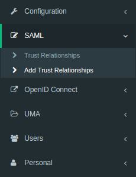
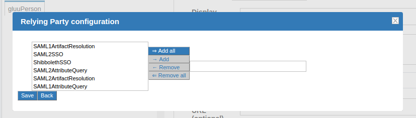
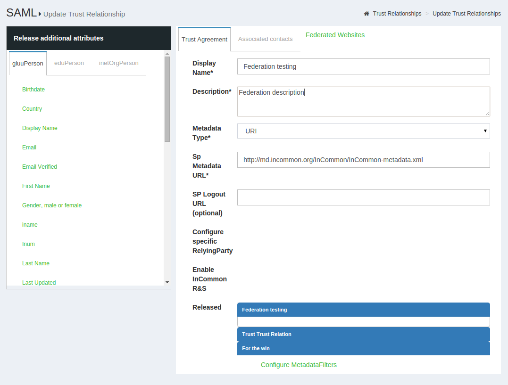

[TOC]
# Authentication Protocol in Gluu Server
Gluu Server supports Security Assertion Markup Language (SAML) and OpenID Connect protocols to authenticate users against Service Providers (SPs) and Requesting Parties (RPs). There are two different flows of SAML known as outbound SAML and inbound SAML, both supported out-of-the-box in Gluu Server Community Edition (Gluu CE).

## 2.1 Outbound SAML
Outbound SAML can also be called SP-initiated Single Sign On (SSO) or traditional SAML. In an outbound SAML transaction, the SP redirects the user to the designated Identity Provider (IDP) for authentication and authorization. The IDP will ask for the username and password for the user and up on successful authentication, the user is sent back to the SP logged in. The requirement for the IDP is a trust relationship (TR) set up beforehand with the SP. The next section covers how to set up a TR in Gluu Server.

### 2.1.1 Trust Relationship Requirements
Trust Relationship creation is easy in Gluu Server from the oxTrust GUI. The following information is necessary to create TR.

- [Metadata of website](#metadata-of-website)
- [Required attribute of website](#required-attribute-of-website)
- [SSO testing endpoint of website](#sso-testing-endpoint-of-website)

#### 2.1.1.1 Metadata of the SP
Metadata is a XML file which has configuration data used to provision any
website (SP) or IDP (Gluu Server) to communicate with each other. It is
interchangeable between the IDP and the SP.

Websites (SP) can provide metadata via URL or as a separate file. If the
SP provides an separate XML file, the Gluu Server can check the
integrity of that metadata with its own mechanism. This mechanism can be
shown and tested from Gluu Server oxTrust GUI.

#### 2.1.1.2 Required Attributes
Every organization has their own policy to release/share attributes with
any IDP or SP. The oxTrust GUI supports both preconfigured and custom attribute
Release to the SP. The administrator only needs to click on the desired 
attribute and it will be released to the SP.

#### 2.1.1.3 SSO Testing Endpoint
Every website (SP) should have both a staging and a production uri
endpoint which can be checked for SSO, where the user will access to log
into that SP.

### 2.1.2 Create a Trust Relationship
* Go to SAML → Trust Relationships
* Click on “Add Relationship”

* A new page will appear. Here, as a Gluu Server administrator you need
  to provide all the information regarding the SP to establish Trust
  Relationship from Gluu Server.

* _Display Name_: Name of the Trust Relationship (it should be unique for every trust relationship)
* _Description_: Little description. Purpose and SSO link can be added here.
* _Metadata Type_: Depending on trusted party’s metadata (SP), there are four available types in Gluu Server
    * _File_: If SP has uploadable metadata in XML format, this option works best.
    * _URI_: If the metadata of SP has URI link and accessible from the internet, Gluu Server Administrator can use this option.
* _Released_: The attributes that are required for the SP must be in this pane. The required attributes can be selected from the left side pane with the heading “Release Additional Attributes”.
The TR is added by clicking on the `Add` button located in the lower left side of the page.

#### 2.1.2.1 Relying Party Configuration
The Relying Party must be configured for some SPs. The relying party configuration is accessible on the TR Creation page. The checkbox `Configure specific Relying Party` must be checked.

The checkbox will result in a link which can be accessed to configure relying party for the TR. The image below shows the relying party config panel from which the administrator can add the specific option.

#### 2.1.2.2 Federation Configuration
If the SP is part of any identity federation such as InCommon Federation, then the administrator must add the federation as a SP in Gluu Server. This will allow the administrator to add SPs under the federation easily from a TR. The requirement of a federation TR created using the general TR is a must. The example below shows an administrator adding a TR for InCommon Federation.

Once this is done, the SPs under the federation can be added by selecting the Federation from the `Federation Name` drop down menu and selecting the entity-id for the SP.

## 2.2 Inbound SAML
