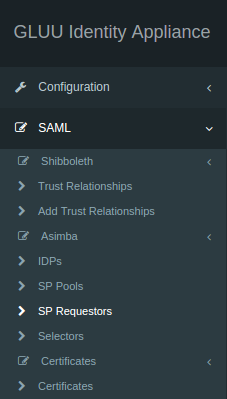
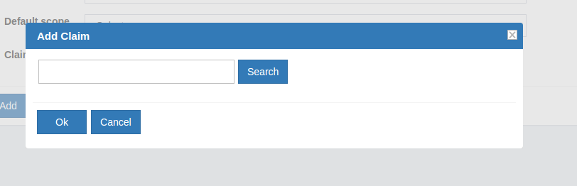
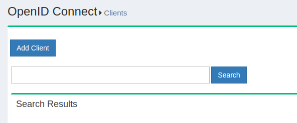
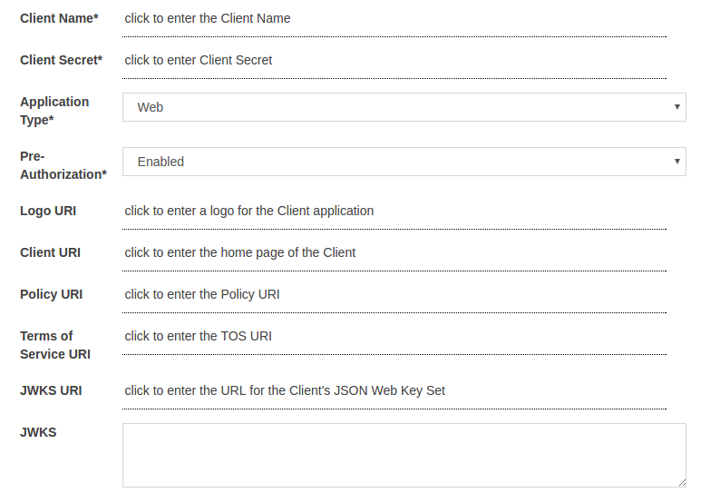
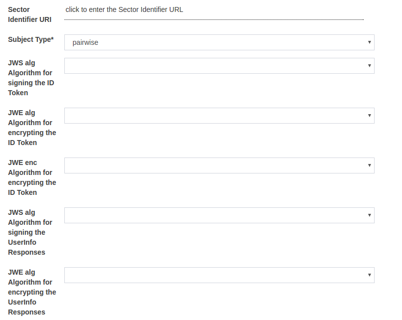
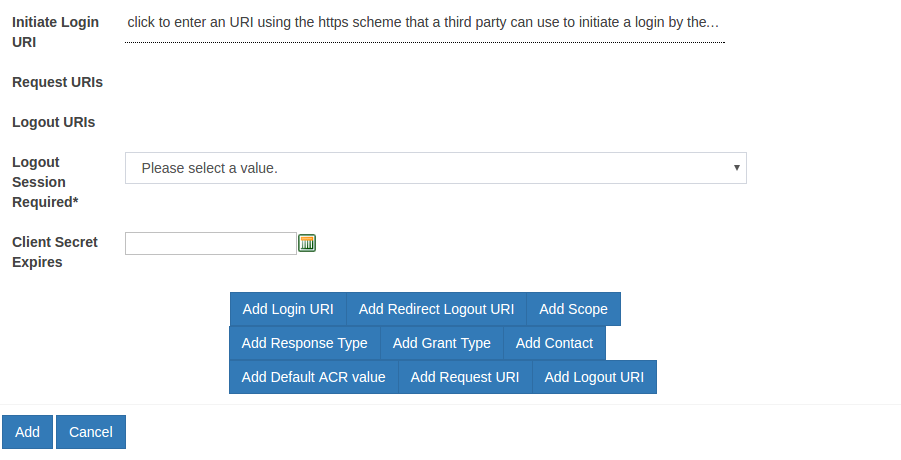
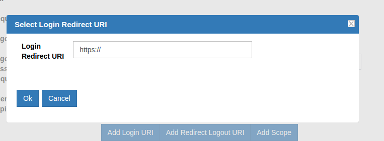
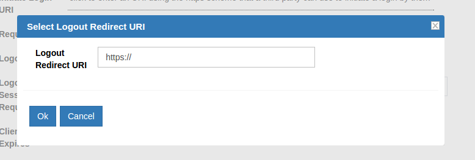
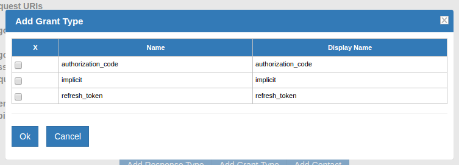
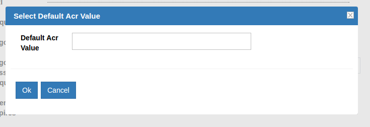

[TOC]
# Authentication Protocol in Gluu Server
Gluu Server supports Security Assertion Markup Language (SAML) and OpenID Connect protocols to authenticate users against Service Providers (SPs) and Requesting Parties (RPs). There are two different flows of SAML known as outbound SAML and inbound SAML, both supported out-of-the-box in Gluu Server Community Edition (Gluu CE).

## 2.1 Outbound SAML
Outbound SAML can also be called SP-initiated Single Sign On (SSO) or traditional SAML. In an outbound SAML transaction, the SP redirects the user to the designated Identity Provider (IDP) for authentication and authorization. The IDP will ask for the username and password for the user and up on successful authentication, the user is sent back to the SP logged in. The requirement for the IDP is a trust relationship (TR) set up beforehand with the SP. The next section covers how to set up a TR in Gluu Server.

### 2.1.1 Trust Relationship Requirements
Trust Relationship creation is easy in Gluu Server from the oxTrust GUI. The following information is necessary to create TR.

- [Metadata of website](#metadata-of-website)
- [Required attribute of website](#required-attribute-of-website)
- [SSO testing endpoint of website](#sso-testing-endpoint-of-website)

#### 2.1.1.1 Metadata of the SP
Metadata is a XML file which has configuration data used to provision any
website (SP) or IDP (Gluu Server) to communicate with each other. It is
interchangeable between the IDP and the SP.

Websites (SP) can provide metadata via URL or as a separate file. If the
SP provides an separate XML file, the Gluu Server can check the
integrity of that metadata with its own mechanism. This mechanism can be
shown and tested from Gluu Server oxTrust GUI.

#### 2.1.1.2 Required Attributes
Every organization has their own policy to release/share attributes with
any IDP or SP. The oxTrust GUI supports both preconfigured and custom attribute
Release to the SP. The administrator only needs to click on the desired 
attribute and it will be released to the SP.

#### 2.1.1.3 SSO Testing Endpoint
Every website (SP) should have both a staging and a production uri
endpoint which can be checked for SSO, where the user will access to log
into that SP.

### 2.1.2 Create a Trust Relationship
* Go to SAML → Trust Relationships
* Click on “Add Relationship”


* A new page will appear. Here, as a Gluu Server administrator you need
  to provide all the information regarding the SP to establish Trust
  Relationship from Gluu Server.


* _Display Name_: Name of the Trust Relationship (it should be unique for every trust relationship)
* _Description_: Little description. Purpose and SSO link can be added here.
* _Metadata Type_: Depending on trusted party’s metadata (SP), there are four available types in Gluu Server
    * _File_: If SP has uploadable metadata in XML format, this option works best.
    * _URI_: If the metadata of SP has URI link and accessible from the internet, Gluu Server Administrator can use this option.
* _Released_: The attributes that are required for the SP must be in this pane. The required attributes can be selected from the left side pane with the heading “Release Additional Attributes”.
The TR is added by clicking on the `Add` button located in the lower left side of the page.

#### 2.1.2.1 Relying Party Configuration
The Relying Party must be configured for some SPs. The relying party configuration is accessible on the TR Creation page. The checkbox `Configure specific Relying Party` must be checked.


The checkbox will result in a link which can be accessed to configure relying party for the TR. The image below shows the relying party config panel from which the administrator can add the specific option.


#### 2.1.2.2 Federation Configuration
If the SP is part of any identity federation such as InCommon Federation, then the administrator must add the federation as a SP in Gluu Server. This will allow the administrator to add SPs under the federation easily from a TR. The requirement of a federation TR created using the general TR is a must. The example below shows an administrator adding a TR for InCommon Federation.


Once this is done, the SPs under the federation can be added by selecting the Federation from the `Federation Name` drop down menu and selecting the entity-id for the SP.


## 2.2 Inbound SAML Script
Gluu Server uses an open source product called Asimba to achieve inbound SAML. Asimba allows websites to use a single IDP for SSO even when the organization has multiple trusted IDPs. Please see the [Asimba website](http://www.asimba.org/site/) for more information.

Gluu Server CE makes Asimba configuration easy from the oxTrust admin interface. This section provides a step-by-step method of configuring Asimba with two (2) IDPs and a single SP. The administrator can add multiple IDPs or SPs if required using the same method. However, it is mandatory that all the SPs and IDPs are connected to the Asimba server, or the IDP that has the Asimba module enabled.
i

### 2.2.1 Required Setup

|Setup hostname|Description|
|--------------|-----------|
|https://sp.gluu.org/protected/print.py|This is a shibboleth SP connected to _https://test.gluu.org_|
|https://test.gluu.org| This is a Gluu Server SAML IdP with Asimba|
|https://nest.gluu.org|This is a second Gluu Server SAML IdP connected to _https://test.gluu.org_ |


!!! Note
    Description of SAML Authentication Module is available here: https://github.com/GluuFederation/oxAuth/tree/master/Server/integrations/saml

#### 2.2.1.1 Specific Setup Details
The Gluu Server setup with the hostname `https://test.gluu.org` must be setup with Asimba. This is done by typing `yes` to the [setup script prompt](../installation-guide/setup_py.md).


### 2.2.2 Custom Script Configuration

!!! Note
    The configuration below is done in the Gluu Server with Asimba installed with the hostname `https://test.gluu.org`.

* Log into the oxTrust interface as `admin`

* Navigate to Configuration --> Manage Custom Scripts


* Select/Add `saml` script from `Person Authentication` tab


   - Name: saml
    - Description: Saml Authentication module
    - Programming Language: Python
    - Level: 1
    - Location Type: LDAP
    - Usage Type: Web
    - Custom property (key/value)
       - saml_deployment_type: enroll
       - saml_idp_sso_target_url: https://test.gluu.org/asimba/profiles/saml2/sso/web
       - saml_validate_response: false
       - asimba_entity_id: https://test.gluu.org/saml
       - asimba_saml_certificate_file: /etc/certs/saml.pem 
         - note: Deployer need to copy 'asimba.crt' in 'saml.pem' without the 'BEGIN CERTIFICATE' and 'END CERTIFICATE' tag. 
       - user_object_classes: eduPerson
       - saml_idp_attributes_mapping: { "attribute_name": ["attribute_name", "SAML2 URI"] } 
         - example: ```{"uid": ["uid", "urn:oid:0.9.2342.19200300.100.1.1"], "mail": ["mail", "urn:oid:0.9.2342.19200300.100.1.3"], "givenName": ["givenName", "urn:oid:2.5.4.42"], "sn": ["sn", "urn:oid:2.5.4.4"], "eduPersonPrincipalName": ["eduPersonPrincipalName", "urn:oid:1.3.6.1.4.1.5923.1.1.1.6"] } ```
       - enforce_uniqueness_attr_list: attribute1, attribute2
         - example: ```edupersonprincipalname, uid, mail, givenName```
       - saml_use_authn_context: false
       - saml_generate_name_id: true
    - Script: Please copy the [SAML Script](https://github.com/GluuFederation/oxAuth/blob/master/Server/integrations/saml/SamlExternalAuthenticator.py) from Github. 
    - Enabled: True


### 2.2.3 Adding IDP in Asimba Server

!!! Note
    The configuration below is done in the Gluu Server with Asimba installed with the hostname `https://test.gluu.org`.

* Log into the oxTrust interface

* Navigate to SAML --> Idp


* Click on 'Add IDP' button


* Fill up the form with the information below:
    
    * ID: The entityID of the remote ID/ADFS 

        - Example: `https:<hostname_of_gluu_server>/idp/shibboleth`  

    * Friendly Name: There is no particular format for this field, use anything 

    * Metadata URL: Keep it blank, we will upload metadata

    * Metadata Timeout: Keep it as it is. 

    * Metadata File: Download metadata of remote IDP/ADFS and upload that XML file. 
    
        - Example: The metadata for Gluu IdP can be downloaded using `wget -c https:<hostname_of_gluu_server>/idp/shibboleth`

    * Trust Certificate File: Grab the SAML cert from remote IDP/ADFS and upload that x509 certificate

        - Example: You will get the SAML certificate from Gluu Server's metadata link or available inside `/etc/certs/shibIDP.crt`

    * NameIDFormat: SAML2 URI nameID format if remote IDP is a Gluu Server otherwise ask for their nameID format.

        - Example: `urn:oasis:names:tc:SAML:2.0:nameid-format:transient'

    * Enabled: Yes

    * Send Scoping: Yes

    * AllowCreate: Yes

    * Disable SSO for IDP: No

    * ACS index: Yes

    * Send NameIDPolicy: Yes

    * Avoid Subject Confirmations: No


### 2.2.3 Adding SP Requestor in Asimba Server
* Log into oxTrust interface

* Navigate to SAML --> SP Requestor



* Click on 'Add SP Requestor'


* Please fill up the form with the information below:
     - Select parent SP Pool: requestorpool.1
     - ID: https://test.gluu.org/saml
     - Friendly Name: oxAuth SAML
     - Metadata URL: Not required
     - Metadata Timeout: -1
     - Metadata File: Create a SAML metadata like below and save it as 'saml_oxauth_metadata.xml'. Upload this metadata. 
     - Trust Certificate File: Not required
     - Properties: Not required
     - Enabled: Yes
     - Signing: No
     - metadata snippet: 
``` 
<md:EntityDescriptor xmlns:md="urn:oasis:names:tc:SAML:2.0:metadata" entityID="https://test.gluu.org/saml">
  <md:SPSSODescriptor protocolSupportEnumeration="urn:oasis:names:tc:SAML:2.0:protocol">
    <md:AssertionConsumerService Binding="urn:oasis:names:tc:SAML:2.0:bindings:HTTP-POST" Location="https://test.gluu.org/oxauth/postlogin" index="0"/>
  </md:SPSSODescriptor>
  <md:Organization>
    <md:OrganizationName xml:lang="en">Gluu</md:OrganizationName>
    <md:OrganizationDisplayName xml:lang="en">Gluu - Open Source Access Management</md:OrganizationDisplayName>
    <md:OrganizationURL xml:lang="en">http://www.gluu.org</md:OrganizationURL>
  </md:Organization>
  <md:ContactPerson contactType="technical">
    <md:GivenName>Administrator</md:GivenName>
    <md:EmailAddress>support@gluu.org</md:EmailAddress>
  </md:ContactPerson>
</md:EntityDescriptor> 
```


### 2.2.4 Trust Relationship 
!!! Note
    The configuration below is done in the Gluu Server with Asimba installed with the hostname `https://test.gluu.org`.

Create Trust relationships for all service provides which are included in SAML Proxy SSO workflow. In our test setup we created Trust relationship for remote SP which has entityID 'https://sp.gluu.org/shibboleth'. How to create Trust Relationship is available in [Section 2.1](#2.1-outbound-saml).

!!! Note
    The configuration below is done in the Gluu Server with Asimba installed with the hostname `https://nest.gluu.org`.

Log into the oxTrust inteface and follow the steps to add a new Trust Relationship.

  - Gluu Server's Asimba metadata can be achieved from 'https://test.gluu.org/asimba/profiles/saml2'
    - Download the metadata and use 'File' method to create Trust relationship
  - Relying Party Configuration: 'SAML2SSO' Profile 
![
    - example: 
        - includeAttributeStatement: Yes
        - assertionLifeTime: 300000
        - assertionProxyCount: 0
        - signResponses: conditional
        - signAssertions: never
        - signRequests: conditional
        - encryptAssertions: never
        - encryptNameIds: never
  - Attribute: Any attribute Service Providers require. Any kind of nameID from below list is mandatory. 
     - nameID: 
        - `nameIDFormat="urn:oasis:names:tc:SAML:1.1:nameid-format:unspecified"`
        - `nameIDFormat="urn:oasis:names:tc:SAML:2.0:nameid-format:transient"`
        - `nameIDFormat="urn:oasis:names:tc:SAML:1.1:nameid-format:emailAddress"`
     - How to create nameID in Gluu Server is available [here](https://gluu.org/docs/customize/attributes/#custom-nameid)

### 2.2.5 Test Asimba with SAML Proxy
Here is a quick video on how SAML Proxy SSO might look like. Here in this video we are using 'https://sp.gluu.org/protected/print.py' as our protected service provider link. After initiating the SSO, we are moved to Gluu Server's SAML Proxy discovery page ( https://test.gluu.org ). From there we selected 'Nest' as our desired authentication server. After succesful authentication we are landing to proctected resource. 

* [Youtube Video Link](https://youtu.be/YEyrOWJu0yo)

## 2.3 OpenID Connect
[OpenID Connect](http://openid.net/connect "Connect") is a standard
profile of OAuth2 which defines a protocol to enable a website or mobile
application to send a person to a domain for authentication and required
attributes (e.g. email address, first name, last name, etc.). OpenID Connect
also provides some of the plumbing around authentication to automate how
this happens. If a person is visiting a website for the first time, the
process that OpenID Connect defines is 100% bootstrapable by the
website. This is really critical for Internet scalability. To visit
someone's website, or to send someone an email, you do not need to get
the system administrators involved. Connect provides the same type of
scalable infrastructure for authentication and authorization, and promises to define a base level domain
identification.

### 2.3.1 Scopes


In SAML, the IdP releases attributes to the SP. OpenID Connect provides
similar functionality, with more flexibility in case the person needs to
self-approve the release of information from the IdP to the website (or
mobile application). In OAuth2, scopes can be used for various purposes.
OpenID Connect uses OAuth2 scopes to "group" attributes. For example, we
could have a scope called "address" that includes the street, city,
state, and country user claims. 


#### 2.4.1.1 Add Scope
The Gluu Server administrator can easily add more scopes in the GUI.


Click *Add Scope* and you will be presented with the following screen:


The following fields are available for input.

* Display Name
* Description
* Scope Type
* Default Scope
* Claims

_Default Scope:_ When a client uses dynamic
client registration, the OpenID Connect specification says that the
`openid` scope should always be released, which contains an identifier
for that person, normally the username. If you want to release another
scope automatically, set the Default Scope to `true` for that scope. You
can always explicitly release a scope to a certain client later on, but
this will require some manual intervention by the domain administrator.

_Claims:_ The administrator can add claims in the scope by clicking on `Add Claim` button. The following screen shall appear on clicking the button.


### 2.3.2 Client


A client in OAuth2 could be either a website or mobile application.
OpenID Connect has an API for [Dynamic Client
Registration](http://openid.net/specs/openid-connect-registration-1_0.html)
which efficiently pushes the task to the application developer. If you
do not want to write an application to register your client, there are a
few web pages around that can do the job for you. Gluu publishes the
[oxAuth-RP](https://ce-dev.gluu.org/oxauth-rp) and there is also another in [PHP
RP](http://www.gluu.co/php-sample-rp).

A new client can be added by clicking the **Add Client** link.



Available **Clients** can be seen by hitting the **Search** button
leaving the search box empty.


#### 2.3.2.1 Register Client
Gluu Server Administrators can click on the `Add Client` button to register new clients. It is possible to dynamically register any client by calling the dynamic registration endpoint, but this section focuses on the manual registration of the client. The following screen appears when the `Add Client` button is clicked.



* _Client Name:_ This contains the recognizable and unique display name
  of the client. The name of the Client to be presented to the End-User.

* _Client Secret:_ This is the Data Encryption Standard scheme used by
  Confidential Clients to authenticate to the token endpoint. The value for the secret can be inserted manually.

* _Application Type:_ There are two types of applications, Web and
  Native.

	* _Web:_ The Dynamic Client Registration is the default for web. In this type the redirect_uri for implicit grant type must be a real
    hostname with HTTPS. This type is not approved any localhost or HTTP. The web application uses the authorization code flow for clients which
    can maintain a client secret between the uris and the authorization
    server.

	* _Native:_ Custom uri for Native type application have to follow HTTP with localhost. This is suitable for a mobile app which cannot maintain the client secret between itself and the authorization server.

* _Pre Authorization:_ Allow pre-authorized Client Applications 

* _Logo URI:_ The URL of the logo for the client application.
  If present, the server will display this image to the End-User during approval.

* _Client URI:_ The URL of the home page of the client.

* _Policy URI:_ The URL of the Privacy policy.

* _Terms of Service URI:_ The URL to the Terms of Use of the Client.

* _JWKS URI:_ The URL for the Client's JSON Web Key Set.
  
* _JWKS:_ The value of  Client's JSON Web Key Set. The jwks_uri and jwks parameters MUST NOT be used together.



* _Sector Identifier URI:_ URL using the https scheme to be used in calculating Pseudonymous Identifiers by the OP.
  The URL references a file with a single JSON array of redirect_uri values.
  
* _Subject Type:_ The subject type requested for responses to this Client.

* _JWS alg Algorithm for signing the ID Token:_ JWS alg algorithm for signing the ID Token issued to this Client.
  See [Algorithms section](#algorithm) for options.

* _JWE alg Algorithm for encrypting the ID Token:_ JWE alg algorithm for encrypting the ID Token issued to this Client.
  See [Algorithms section](#algorithm) for options.

* _JWE enc Algorithm for encrypting the ID Token:_ JWE enc algorithm for encrypting the ID Token issued to this Client.
  See [Algorithms section](#algorithm) for options.

* _JWS alg Algorithm for signing the UserInfo Responses:_ JWS alg algorithm for signing UserInfo Responses.
  If this is specified, the response will be JWT serialized, and signed using JWS.
  See [Algorithms section](#algorithm) for options.

* _JWS alg Algorithm for encrypting the UserInfo Responses:_  JWE alg algorithm for encrypting UserInfo Responses.
  See [Algorithms section](#algorithm) for options.


* _JWE enc Algorithm for encrypting the UserInfo Responses:_ JWE enc algorithm for encrypting UserInfo Responses. 
  See [Algorithms section](#algorithm) for options.

* _JWS alg Algorithm for signing Request Objects:_ JWS alg algorithm used for signing Request Objects sent to the OP.
  This algorithm is used when the Request Object is passed by value (using the request parameter) and when it is
  passed by reference (using the request_uri parameter).
  The value none can be used.
  See [Algorithms section](#algorithm) for options.

* _JWE alg Algorithm for encrypting Request Objects:_ JWE alg algorithm the RP is declaring that it use for
  encrypting Request Objects sent to the OP.
  See [Algorithms section](#algorithm) for options.

* _JWE enc Algorithm for encrypting Request Objects:_ JWE enc algorithm the RP is declaring that it may use for
  encrypting Request Objects sent to the OP.
  See [Algorithms section](#algorithm) for options.

* _Authentication method for the Token Endpoint:_ Requested Client Authentication method for the Token Endpoint.
  The options are client_secret_post, client_secret_basic, client_secret_jwt, private_key_jwt, and none.
  If omitted, the default is client_secret_basic, the HTTP Basic Authentication Scheme.


* _JWS alg Algorithm for Authentication method to Token Endpoint:_ JWS alg algorithm used for signing the JWT
  used to authenticate the Client at the Token Endpoint for the private_key_jwt and client_secret_jwt
  authentication methods. The value none cannot be used.
  See [Algorithms section](#algorithm) for options.

* _Default Maximum Authentication Age:_ Specifies that the End-User must be actively authenticated if the End-User was
  authenticated longer ago than the specified number of seconds.
  If omitted, no default Maximum Authentication Age is specified.

* _Require Auth Time:_ Specifies whether the auth_time Claim in the ID Token is required.
  If omitted, the default value is false.

* _Persist Client Authorizations*:_ Specifies whether to persist user authorizations.



* _Initiate Login URI:_ URI using the https scheme that a third party can use to initiate a login by the RP.

* _Request URIs:_ Array of request_uri values that are pre-registered by the RP for use at the OP.
   The Server cache the contents of the files referenced by these URIs and not retrieve them at the time they are used in a request.

* _Logout URIs:_ Redirect logout URLs supplied by the RP to which it can request that the End-User's
  User Agent be redirected using the post_logout_redirect_uri parameter after a logout has been performed.

* _Logout Session Required*:_ Specifies whether the RP requires that a sid (session ID) query parameter
  be included to identify the RP session at the OP when the logout_uri is used.
  If omitted, the default value is false.

* _Client Secret Expires:_ Time at which the client will expire or 0 if it will not expire.

* _Add Login URI:_ This option can be used to add the login URL.


* _Add Redirect Logout URI:_ The logout request, if requires a redirection can be added here.


* _Add Scopes:_ This option can be used to add the required scopes in the Gluu Server.
The available scopes can be listed by hitting the *Search* button, and
  keeping the search phrase blank. Furthermore, from this the Gluu Server administrator can select the required scopes.

* _Add Response Type:_ There are three types of responses in the Gluu
  Server and they are Code, Token and ID Token. The Gluu Server
  Administrator can select all of them for testing purposes.


* _Add Grant Type:_ There are 3 grant type available in this option `authorization_code, implicit, refresh_token`


* _Add Contact:_ Use this option to add the email address for the Client contact

* _Add Default ACR value:_ The default ACR Value is defined through this option and it is used to include multi-factor authentication in registered clients. Please use this option to define which from of authentication to use for specific client. See section 2.3.2.1 for details.


* _Add Request URI:_ Use this option to add the Request URI

* _Add Logout URI:_ Use this option to add the logout URI.

#### 2.3.2.1 Multi-Factor Authentication for Clients
The `acr_values` parameter is used to specify the use of specific multi-factor authentication for each client. If a scenario is presented where different clients use different authentication mechanism, then the `acr_value` parameter is used to specify the choice. Out of the box, GLuu Server supports U2F, DUO, Basic, oxPush/SuperGluu, Google+ and internal LDAP authentication. While registering new clients, put the mode in `Add Default ACR value` to chosen mechanism. The authentication mechanism must be enabled in the `Custom Scripts` section as well.

!!! Note
    Supported ACR Values in Client Registration: "u2f", "duo", "basic", "mt", "oxpush2", "gplus", "internal"

The values appear in order of preference and the successful authentication is sent as the acr claim value in the issued ID Token. The table below explains the acr values. Please click on the description to access the specific how-to guide for the ACR declared authentication.

|  ACR Value  	| Description			|
|---------------|-------------------------------|
|  u2f		| [FIDO U2F Device](../multi-factor/u2f)|
|  duo		| [Duo soft-token authentication](../multi-factor/duo)|
|  basic	| Username/Password authentication from LDAP Server|
|  oxpush2	| [Multi-factor authentication](../multi-factor/oxpush2)|
|  gplus	| [Google+ authentication](../customize/social-login-google)|
|  internal	| Use Gluu Server LDAP to authenticate users|

#### 2.3.2.2 Algorithm
oxAuth supports various types of signature and encryption
algorithms for authorizing request parameter passing, ID token signature
and encryption, signing return responses, Encrypt User Info Endpoints
etc.

**Note:** It is a good practice to implement ID Token Signatures with the RSA
SHA-256 algorithm (algorithm value RS256). Additionally, oxAuth also
supports other algorithms that are listed below.

_Available Signature Algorithms:_ none, HS256, HS384, HS512, RS256, RS384, RS512, ES256, ES384, ES512.

_Encryption, Key Encryption Algorithms:_ RSA1_5, RSA-OAEP, A128KW, A256KW.

_Block Encryption Algorithms:_ A128CBC+HS256, A256CBC+HS612, A128GCM, A256GCM,

### 2.3.3 Custom Client Registration

Using interception scripts you can customize client registration
behavior. For example, by default oxAuth allows new clients to access to
default scopes only. With a custom client registration interception
script it is possible to allow access to more scopes. For instance, we
can use `redirect_uri` to determine if we need to allow access to
additional scopes or not.

To access the interface for custom scripts in oxTrust, navigate to
Configuration --> Custom Scripts --> Custom Client Registration.


The script is [available here](./sample-client-registration-script.py)
