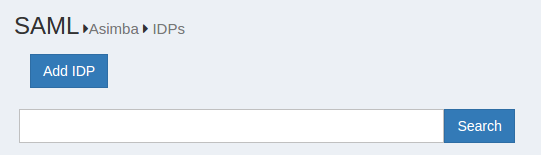

[TOC]
# Authentication Protocol in Gluu Server
Gluu Server supports Security Assertion Markup Language (SAML) and OpenID Connect protocols to authenticate users against Service Providers (SPs) and Requesting Parties (RPs). There are two different flows of SAML known as outbound SAML and inbound SAML, both supported out-of-the-box in Gluu Server Community Edition (Gluu CE).

## 2.1 Outbound SAML
Outbound SAML can also be called SP-initiated Single Sign On (SSO) or traditional SAML. In an outbound SAML transaction, the SP redirects the user to the designated Identity Provider (IDP) for authentication and authorization. The IDP will ask for the username and password for the user and up on successful authentication, the user is sent back to the SP logged in. The requirement for the IDP is a trust relationship (TR) set up beforehand with the SP. The next section covers how to set up a TR in Gluu Server.

### 2.1.1 Trust Relationship Requirements
Trust Relationship creation is easy in Gluu Server from the oxTrust GUI. The following information is necessary to create TR.

- [Metadata of website](#metadata-of-website)
- [Required attribute of website](#required-attribute-of-website)
- [SSO testing endpoint of website](#sso-testing-endpoint-of-website)

#### 2.1.1.1 Metadata of the SP
Metadata is a XML file which has configuration data used to provision any
website (SP) or IDP (Gluu Server) to communicate with each other. It is
interchangeable between the IDP and the SP.

Websites (SP) can provide metadata via URL or as a separate file. If the
SP provides an separate XML file, the Gluu Server can check the
integrity of that metadata with its own mechanism. This mechanism can be
shown and tested from Gluu Server oxTrust GUI.

#### 2.1.1.2 Required Attributes
Every organization has their own policy to release/share attributes with
any IDP or SP. The oxTrust GUI supports both preconfigured and custom attribute
Release to the SP. The administrator only needs to click on the desired 
attribute and it will be released to the SP.

#### 2.1.1.3 SSO Testing Endpoint
Every website (SP) should have both a staging and a production uri
endpoint which can be checked for SSO, where the user will access to log
into that SP.

### 2.1.2 Create a Trust Relationship
* Go to SAML → Trust Relationships
* Click on “Add Relationship”


* A new page will appear. Here, as a Gluu Server administrator you need
  to provide all the information regarding the SP to establish Trust
  Relationship from Gluu Server.


* _Display Name_: Name of the Trust Relationship (it should be unique for every trust relationship)
* _Description_: Little description. Purpose and SSO link can be added here.
* _Metadata Type_: Depending on trusted party’s metadata (SP), there are four available types in Gluu Server
    * _File_: If SP has uploadable metadata in XML format, this option works best.
    * _URI_: If the metadata of SP has URI link and accessible from the internet, Gluu Server Administrator can use this option.
* _Released_: The attributes that are required for the SP must be in this pane. The required attributes can be selected from the left side pane with the heading “Release Additional Attributes”.
The TR is added by clicking on the `Add` button located in the lower left side of the page.

#### 2.1.2.1 Relying Party Configuration
The Relying Party must be configured for some SPs. The relying party configuration is accessible on the TR Creation page. The checkbox `Configure specific Relying Party` must be checked.


The checkbox will result in a link which can be accessed to configure relying party for the TR. The image below shows the relying party config panel from which the administrator can add the specific option.


#### 2.1.2.2 Federation Configuration
If the SP is part of any identity federation such as InCommon Federation, then the administrator must add the federation as a SP in Gluu Server. This will allow the administrator to add SPs under the federation easily from a TR. The requirement of a federation TR created using the general TR is a must. The example below shows an administrator adding a TR for InCommon Federation.


Once this is done, the SPs under the federation can be added by selecting the Federation from the `Federation Name` drop down menu and selecting the entity-id for the SP.


## 2.2 Inbound SAML
Gluu Server uses an open source product called Asimba to achieve inbound SAML. Asimba allows websites to use a single IDP for SSO even when the organization has multiple trusted IDPs. Please see the [Asimba website](http://www.asimba.org/site/) for more information.

Gluu Server CE makes Asimba configuration easy from the oxTrust admin interface. This section provides a step-by-step method of configuring Asimba with two (2) IDPs and a single SP. The administrator can add multiple IDPs or SPs if required using the same method. However, it is mandatory that all the SPs and IDPs are connected to the Asimba server, or the IDP that has the Asimba module enabled.

### 2.2.1 Required Setup
|Setup hostname|Description|
|--------------|-----------|
|https://sp.gluu.org|This is a shibboleth SP connected to _https://test.gluu.org_|
|https://test.gluu.org| This is a Gluu Server SAML IdP with Asimba|
|https://nest.gluu.org|This is a second Gluu Server SAML IdP connected to _https://test.gluu.org_ |

!!! Note
    Ideally all SPs and IdPs should be connected to Asimba server.

### 2.2.2 Adding IDP in Asimba Server

* Log into the oxTrust interface

* Navigate to SAML --> Idp


* Click on 'Add IDP' button



* Fill up the form with the information below:
    
    * ID: The entityID of the remote ID/ADFS 

        - Example: `https:<hostname_of_gluu_server>/idp/shibboleth`  

    * Friendly Name: There is no particular format for this field, use anything 

    * Metadata URL: Keep it blank, we will upload metadata

    * Metadata Timeout: Keep it as it is. 

    * Metadata File: Download metadata of remote IDP/ADFS and upload that XML file. 
    
        - Example: The metadata for Gluu IdP can be downloaded using `wget -c https:<hostname_of_gluu_server>/idp/shibboleth`

    * Trust Certificate File: Grab the SAML cert from remote IDP/ADFS and upload that x509 certificate

        - Example: You will get the SAML certificate from Gluu Server's metadata link or available inside `/etc/certs/shibIDP.crt`

    * NameIDFormat: SAML2 URI nameID format if remote IDP is a Gluu Server otherwise ask for their nameID format.

        - Example: `urn:oasis:names:tc:SAML:2.0:nameid-format:transient'

* Restart tomcat service using this command `service tomcat restart`


### 2.2.3 Adding SP in Asimba Server
* Log into oxTrust interface

* Navigate to SAML --> SP Requestor


* Click on 'Add SP Requestor'


* Please fill up the form with the information below:

    * ID: The entityID of SP

        - Example: Shibboleth SP entityID: `https://sp.gluu.org/shibboleth`

    * Friendly Name: Anything is fine

    * Metadata URL: Keep it blank; we will upload metadata

    * Metadata Timeout: Keep it as it is

    * Metadata File: Upload SP metadata ( xml file )

    * Trust Certificate File: Upload SAML cert from SP

* Restart tomcat service using this command `service tomcat restart`


### 2.2.4 Adding Selectors in Asimba Server
his feature will allow you 'automatically' select specific IDP for specific SP. As for example: If OrgA has SP 'orgASP.gluu.org' and 'orgAIDP.gluu.org' respectively and if you configure selector for 'orgASP.gluu.org' –> 'orgAIDP.gluu.org', then after whenever user will go to 'orgASP.gluu.org', your Gluu Server Asimba will automatically forward user to 'orgAIDP.gluu.org' for authentication.

* Log into oxTrust interface

* Navigate to SAML --> Selectors


* Click on the 'Add Selector' button


    * Select SP Requestor: Select your desired SP from drop down menu

    * Select IDP : Select your desired IDP from drop down menu

* Click on the 'Update' button

* Restart tomcat service using this command `service tomcat restart`


### 2.2.5 Attribute Handling
oxAsimba will transact all kind of attributes whichever authentication server ( remote IDP/ADFS ) can release to SP. By default this feature is not enabled.

* Gluu Server administrator needs to add `<attribute name=“*” />` inside `attributerelease class` in the `asimba.xml` file under `/opt/tomcat/webapps/asimba/WEB-INF/conf` folder

```
         <attributerelease class="com.alfaariss.oa.engine.attribute.release.configuration.ConfigurationFactory">
                <policy id="asimba.releasepolicy.1" friendlyname="Default Attribute Release policy" enabled="true">
                        <attribute name="firstname" />
                        <attribute name="lastname" />
                        <attribute name="email" />
                        <attribute name="role" />
                        <attribute name="*" />
                </policy>
        </attributerelease> 
```

* Uncomment `attributegatherer` part

```
 <gather>
  <attribute name="whitelist-attribute-name" />
 </gather> 
```

* Restart tomcat service:`service tomcat restart` from Gluu Server container

