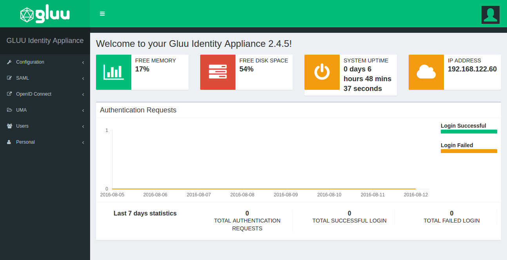
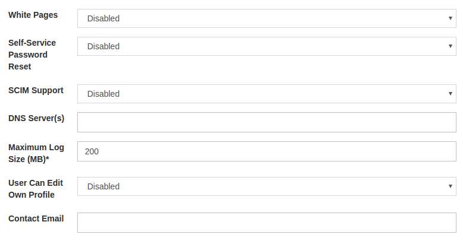

[TOC]

The administration interface (oxTrust) is accessible from the `hostname` provided in the prompt from the setup script. After the installation is complete, log in to the web-based interface with the username `admin` and the `LDAP superuser` password. 

# Welcome Page
The administrator is taken to the welcome page if the username and the password is correct. Some basic information about the VM/server is displayed in the welcome screen. The version is displayed on top followed by free memory,disk space. The health of the VM/server can be easily determined from the welcome page.

------------------------------------------
The menu on the left side of the welcome page is used to navigate the admin interface for Gluu Server.

# Configuration
The configuration tab contians the tools to configure Gluu Server CE. This section is dedicated to all tuning and tinkering except integration tools.
The configuration menu is divided in to other sections which are revealed on click. The administrator can manage authentication, registration, attributes, cache-refresh,logs etc. from this menu.

###Organization Configuration
#### System Configuration

Gluu Server CE is shipped with a built-in `White Pages` feature which can be enabled from the system configuration page. This page also contains the options to enable `Self-Service Password Reset` which allows the Gluu Server users to reset their password via email. This options depends on the SMTP Server Configuration, so this option should only be enabled if the SMTP server has been successfully configured. Additionally the `SCIM Support` can be enabled from the System Configuration page. If the organization uses any custom `DNS Server(s)`, the address should be updated on this page too.

