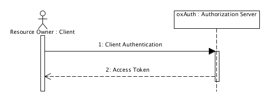

Gluu Server supports Security Assertion Markup Language (SAML) and OpenID Connect protocols to authenticate users against Service Providers (SPs) and Requesting Parties (RPs). There are two different flows of SAML known as outbound SAML and inbound SAML, both supported out-of-the-box in Gluu Server Community Edition (Gluu CE).

## 2 SAML


Security Assertion Markup Language (SAML) is an authentication and authorization protocol that defines the transaction process for XML-encoded assertions about authentication, authorization and attributes. The protocol is goverened by [Security Assertion Markup Language Core
(SAML) V2.0](https://docs.oasis-open.org/security/saml/v2.0/saml-core-2.0-os.pdf "SAML 2.0 Core"). The goal of this protocol is to exchange authentication and authorization data between Service Providers (SP) and the Identity Provider (IDP).
Gluu Server supports both inbound and outbound flow of SAML transaction. The oxTrutst administrator interface makes it easy to use SAML.

Trust Relationships are the foundation on which SAML works. Gluu Server makes it easy to setup Trust Relationships from the oxTrust admin interface. There are two types of flow Gluu CE supports, inbound and outbound SAML.
Trust Relationship creation is mandatory in both flows; however, the inbound flow also acts as a SAML proxy. The details about how to setup a Trust Relationship and how to setup SAML proxy follows later in this documentation. The image below is taken from wikipedia, showing a SAML transaction workflow.


## 3 OpenID Connect


[OpenID Connect](http://openid.net/connect "Connect") is a standard     │s/new-docs/source/img/uma/auth-complete.png
OpenID Connect is a standard profile of OAuth2 which defines a protocol to enable any website, mobile application to verify the identity of the user accessing its resources through an authorization server or identity server. The protocol is API friendly and works through endpoints making it easy for applications to use it. 

OpenID Connect specification consists of different documents which outline different aspects of the protocol. The basic implementation requires the [OpenID Connect Core Specification](http://openid.net/specs/openid-connect-core-1_0.html "Core Specification"). The figure below taken from the [OpenID Connect website](http://openid.net/ "openid.net") shows the overview of the protocol and the different parts of the specification.


### 3.1 Terminology

- Claim: Information about the entity
- ID Token: JSON Web Token (JWT) that contains claims about the authentication
- Issuer: The authority that issues the claims
- OpenID Provider (OP): OAuth2.0 authorization server that authenticates user through claims to the Relying Party (RP)
- Relying Party (RP): OAuth 2.0 Client application that requires authentication and claims from an OpenID Provider(OP)
- UserInfo Endpoint: An URL using https that returns authorization for the user from the OP to the RP

### 3.2 Discovery
OpenID Connect provides a simple mechanism to notify about the available endpoints. This is difined in the [OpenID Connect Discovery Specification](http://openid.net/specs/openid-connect-discovery-1_0.html "OpenID Connect Discovery). 

In order for an OpenID Connect Relying Party (RP) to utilize OpenID Connect services for an End-User, the RP needs to know where the OpenID Provider is. OpenID Connect uses WebFinger to locate the OpenID Provider for an End-User.
Once the OpenID Provider has been identified, the configuration information for the OP is retrieved from a well-known location as a JSON document, including its OAuth 2.0 endpoint locations.
If you want to try a discovery request, you can make the following WebFinger request to discover the Issuer location:

```
GET /.well-known/webfinger?resource=https%3A%2F%2Fidp.gluu.org&rel=http%3A%2F%2Fopenid.net%2Fspecs%2Fconnect%2F1.0%2Fissuer HTTP/1.1
Host: idp.gluu.org

HTTP/1.1 200
Content-Type: application/jrd+json

{
    "subject": "https://idp.gluu.org",
    "links": [{
        "rel": "http://openid.net/specs/connect/1.0/issuer",
        "href": "https://idp.gluu.org"
    }]
}
```

## 4 User-Managed Access (UMA)


UMA is an oAuth based protocol to "enable a resource owner to control the authorization of data sharing and other protected-resource access made between online services on the owner’s behalf or with the owner’s authorization by an autonomous requesting party"[1][].

### 4.1 Enterprise UMA
The Gluu Server implements UMA in a way that enables the protection of any web resource. Through the oxTrust interface, the server admin can write [custom authorization interception scripts][2] which may contain logic to grant (or forbid) access. The diagram below shows an overview of the UMA Authorization workflow.


### 4.2 Terminology
- Resource Server (RS): Where the resources are held. 
- Authorization Server (AS): A server that governs access based on resource owner policies. 
- Requesting Party (RP): An end-user, or a corporation or other legal person, that uses a client to seek access to a protected resource. The requesting party may or may not be the same party as the resource owner. 
- Client: A web or native app that is used to access a digital resource. 
- Protection API Token (PAT): An entity seeking protection API access MUST have the scope "uma_protection". An access token with at least this scope is called a protection API token (PAT) and an entity that can acquire an access token with this scope is by definition a resource server. 
- Requesting Party Token (RPT): the token that a client presents to a resource server when trying to access a protected resource. 
- Authorization API Token (AAT): An entity seeking authorization API access MUST have the scope "uma_authorization". An access token with at least this scope is called an authorization API token (AAT) and an entity that can acquire an access token with this scope is by definition a client.

### 4.3 UMA Workflow
The complete workflow sequence is shown in the diagram below. However there are two different authorization workflow given below for authorization and authorization token.


#### 4.3.1 Authorization


#### 4.3.1 Authorization Token


### 4.4 Discovery
Gluu Server CE provides an endpoint for discovering information about UMA Provider configuration. A resource server or client can perform an HTTP GET on `https://<hostname>/.well-known/uma-configuration` to retrieve a JSON object indicating the UMA Provider configuration.

The following is an example of a GET request to the UMA configuration discovery endpoint:
```
{
  "version": "1.0",
  "issuer": "https://gluuserver.org",
  "pat_profiles_supported": [
    "bearer"
  ],
  "aat_profiles_supported": [
    "bearer"
  ],
  "rpt_profiles_supported": [
    "bearer"
  ],
  "pat_grant_types_supported": [
    "authorization_code"
  ],
  "aat_grant_types_supported": [
    "authorization_code"
  ],
  "claim_profiles_supported": [
    "openid"
  ],
  "dynamic_client_endpoint": "https://gluuserver.org/oxauth/seam/resource/restv1/oxauth/register",
  "token_endpoint": "https://gluuserver.org/oxauth/seam/resource/restv1/oxauth/token",
  "user_endpoint": "https://gluuserver.org/oxauth/seam/resource/restv1/oxauth/authorize",
  "introspection_endpoint": "https://gluuserver.org/oxauth/seam/resource/restv1/host/status",
  "resource_set_registration_endpoint": "https://gluuserver.org/oxauth/seam/resource/restv1/host/rsrc",
  "permission_registration_endpoint": "https://gluuserver.org/oxauth/seam/resource/restv1/host/rsrc_pr",
  "rpt_endpoint": "https://gluuserver.org/oxauth/seam/resource/restv1/requester/rpt",
  "authorization_request_endpoint": "https://gluuserver.org/oxauth/seam/resource/restv1/requester/perm",
  "scope_endpoint": "https://gluuserver.org/oxauth/seam/resource/restv1/uma/scopes"
}
```

!!! Note
    The UMA Response  may contain custom properties which are uniquely named for convenience and disguishing between standard & custom properties.

[1]:http://kantarainitiative.org/confluence/display/uma/Charter "UMA Charter"
[2]: ../index.md "Custom Scripts"

## 4 OAuth2.0 


OAuth2.0 is the next version in the OAuth protocol focusing on simplicity with specific authorization flows for different platforms. The core specification is called the [OAuth 2.0 Authorization Framework](https://tools.ietf.org/html/rfc6749). OAuth introduces an authorization layer and separates the role of the client from the resource owner. The resource is accessed using access tokens instead of credentials.

### 4.1 Terminology
- Resource Owner (RO): Entity that owns and controls the access to any resource
- Resource Server (RS): Where the resources are held
- Client: Any application/web-site that requests access to the protected resource stored in any RS.
- Authorization Server: The server issuing access tokens to the client after successfully authenticating the resource owner and obtaining authorization

### 4.2 Workflows
####4.2.1 Client Credentials Grant
The Client Credentials Grant allows [RO][] to use username and password as an authorization grant to obtain an access token. This flow is only encouraged when there is high degree of trust between [RO][] and the client and no other grant types are not available.


[RO]: ./index.md#41-terminology "Resource Owner"
