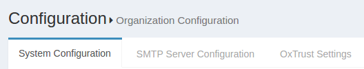

# Introduction
The administration interface (oxTrust) is accessible from the `hostname` provided in the prompt from the setup script. After the installation is complete, log in to the web-based interface with the username `admin` and the `LDAP superuser` password. 

# Welcome Page
The administrator is taken to the welcome page if the username and the password is correct. Some basic information about the VM/server is displayed in the welcome screen. The version is displayed on top followed by free memory,disk space. The health of the VM/server can be easily determined from the welcome page. There is a photo icon on the right hand top side of the page which can be used to navigate to the user-profile and logging out of Gluu Server CE.

The menu on the left side of the welcome page is used to navigate the admin interface for Gluu Server. The menu has separate buttons for SAML, OpenID Connect and UMA. The user-management menu is found under `Users` and the user-profile is under `Personal`.

# Configuration

The configuration tab contians the tools to configure Gluu Server CE. This section is dedicated to all tuning and tinkering except integration tools.
The configuration menu is divided in to other sections which are revealed on click. The administrator can manage authentication, registration, attributes, cache-refresh,logs etc. from this menu.

[Back to top](#introduction)

##Organization Configuration
There are three sections in the organization configuration page which are [System Configuration](#system-configuration), [SMTP Server Configuration](#smtp-server-configuration) and [OxTrust Settings](#oxtrust-settings). These sections are detailed below with screenshots.

### System Configuration
Gluu Server CE is shipped with a built-in `White Pages` feature which can be enabled from the system configuration page. This page also contains the options to enable `Self-Service Password Reset` which allows the Gluu Server users to reset their password via email. This options depends on the [SMTP Server Configuration](#smtp-server-configuration), also available under the organization configuration page. Additionally the `SCIM Support` can be enabled from the System Configuration page. If the organization uses any custom `DNS Server(s)`, the address should be updated from the System Configuration interface.

[Back to top](#introduction)

### SMTP Server Configuration
The mail server used by the Gluu Server to send notification to the pre-selected email address is configured in this page/panel. All the fields in this page are manadory and the configuration can be tested before confirmation. The fields are self-explanatory and simple such as hostname, user, password, ssl-requirement, authentication requirement, sending name and address.

[Back to top](#introduction)

### OxTrust Settings
Some basic information abouht the administrator interface is available in this page. The administrator can find out the oxTrust build date and number by accessing the oxTrust settings page. The administrator can change the organization name, logo and favicon settings from this page as well. Finally oxTrust Settings page contains the name of the administrator group for Gluu Server. The users added in this group will have administrator access in Gluu Server where they will be able to maintain/configure the server.

## JSON Configuration
The configuration files are accessible from the administrator interface (oxTrust). There are three tabs under the `JSON Configuration` menu

### oxTrust Configuration
The oxtrust JSON configuration file is accessible from this tab and it can be edited from this page. The changes are updated by clicking on the `Update` button on the bottom of the page. The details of the file is given later in the [Reference Guide](../reference-guide/index.md).

### oxAuth Configuration
The oxAuth JSON configuration page gives easy access to the different endpoints used by Gluu Server CE. This page also contains the supported response, grants and algorithms among other information. The details will follow later on this documentation.

### oxTrust Import Person Configuration
This page contains the configuration for the file method of importing users into Gluu Server CE. The administrator can import users from a `xls` file which must be defined in this tab to import data in the LDAP attributes. The default format should contain the following fields

|**XLS Coloumn Heading**|Username|First Name|Last Name|Email|Password|
|-----------------------|--------|----------|---------|-----|--------|
|**Attribute Mapping**  |uid     |givenName |sn       | mail|userPassword|

The order of the headings and the format should be exactly like this table, by default, for Gluu Server to import users from any `xls` file. The configuration can be tailored to fit any pre-existing format used by the organization to store user data.
