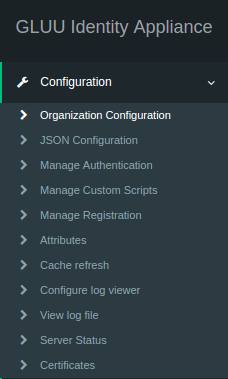

Gluu Server Community Edition supports System for Cross-domain Identity Management (SCIM) Version 1.0 and 2.0 out of the box, operated using HTTP `GET` and `POST` commands. SCIM uses a REST API for operations which are disabled by default. The support for SCIM must be enabled from the oxTrust admin interface. 

## 7.1 Enable SCIM 
SCIM is enabled from the Organization Configuration in the oxTrust administration interface. Please navigate to `Organization Configuration` --> `System Configuration`.

Please navigate down the page to find `SCIM Support` in the `SYstem Configuration` page and select `Enabled`.

