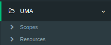
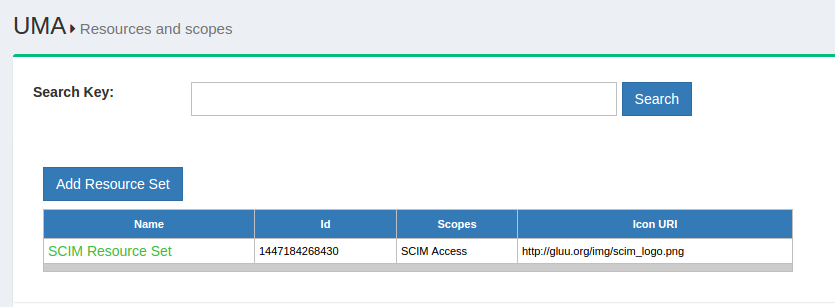
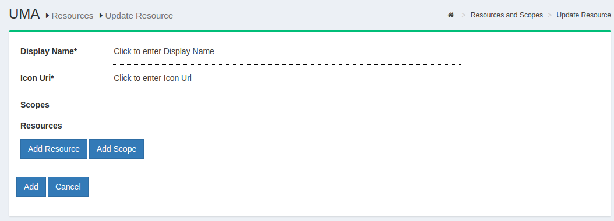
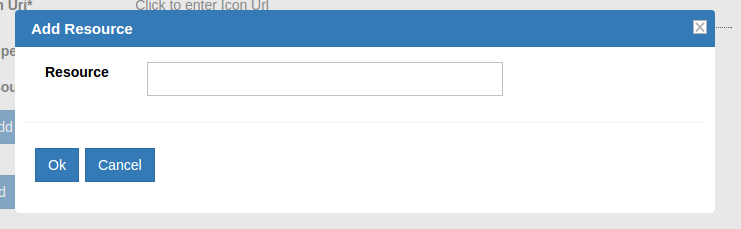
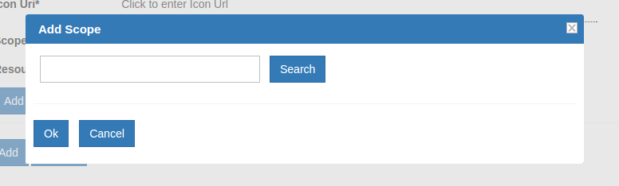
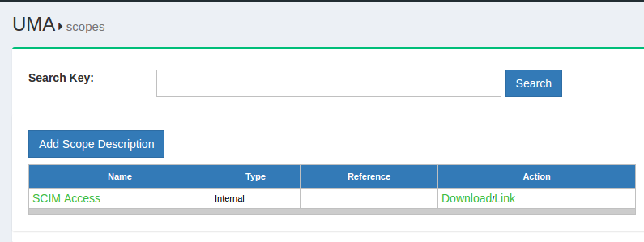
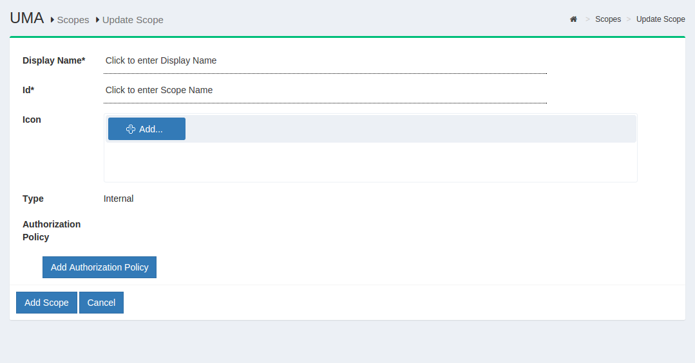

This section describes the adminisration of UMA in Gluu Server CE. The UMA administration is accessible from the oxTrust administrator interface.



## 6.1 Resource Registration
The resources protected by UMA must be registered in oxTrust. The following propterties describe a resource:

- name
- scopes
- type
- icon\_uri

The resource type can be a string, URI or any other supported value type supported by Gluu Server CE. The properties shown above are not concrete, and it is possible that a resource may contain custom properties. An example of the resource JSON is given beow:

```
{
"name":"scim_access",
"icon_uri":"https:\/\/centos.gluu.info\/identity\/uma\/scope\/file\/scim_access"
}
```

!!! Note
    Resource JSON may contain custom properties.



The search bar can be used to search for any existing resource within Gluu Server. New resoruces can be added by clicking on the `Add Resource Set` button. The following screenshot shows the page that will appear up on clicking the add resource button.



The properties of a resource is visible in this page. There are two additional buttons that allows the administrator to add specific resource or scope as well. By default, Gluu Server is shipped with SCIM resources protected by UMA.





## 6.2 Scopes
The scopes in UMA are bount to resource sets and used by policies to check whether the specified user has access to the resource. The scopes are described in JSON and has the following properties:

- name
- icon\_uri

An example  of the scope JSON is given below:

```
{
  "name": "Add photo",
  "icon_uri": "http://www.gluu.org/icons/add_photo_scope.png"
}
```

!!! Note
    Scope JSON may contain custom properties.

### 6.2.1 Define Scope
This section defines the process of defining UMA scopes from oxTrust. The scopes are accessed from the `Scopes` page under `UMA` from the oxTrust menu.



The search bar can be used to look for available scopes. New scopes are added by clicking on the `Add Scope Description` button which will bring up the interface shown below.



Additionally there is an option to add authorization policy with the new scope.
